# 实验 1：从软件测试到形式化验证

**姓名:** 　李文杰
**学号：** 10245101584

---

## 1. 实验主题

　　从熟悉的软件测试出发，使用 CBMC 检查二分查找中的整数中点计算，初步理解形式化工具如何检查一组输入、发现普通测试可能遗漏的整数溢出，并根据用户编写的断言检查功能要求。

## 2. 实验目标

- 为中点计算函数选择具体输入并执行测试，认识普通测试只能检查实际运行过的输入。

- 使用 C 有界模型检测器（C Bounded Model Checker，CBMC）检查所有满⾜输入条件的 `int` 取值，并从反例中找到触发有符号整数溢出（signed integer overflow）的输入。

- 理解验证入口程序（verification harness，简称 harness）中的非确定输入（nondeterministic input）、输入假设和用户断言。

- 区分“计算过程没有整数溢出”和“函数返回了正确中点”这两种不同结论。

- 把 CBMC 给出的反例转化为普通回归测试。

## 3. 最小环境检查（Smoke Test）

　　这里一开始显示环境运行失败：
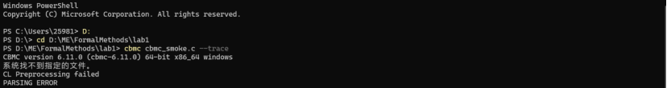
　　这是因为CBMC在我的电脑上找不到 MSVC 的 `cl.exe`，因此默认预处理会失败，加 `--gcc` 即可正常运行。*由于当时不清楚原因，此处咨询了LLM来解决该问题*

> 　　而之所以找不到该文件，是因为`cl.exe` 不是一个能独立运行的 exe，它需要一整套环境变量，所以 VS 不把它加进系统 PATH，而是提供 "Developer Command Prompt" / "x64 Native Tools Command Prompt" 快捷方式，由它们先运行 `vcvars64.bat` 把环境配好。而我使用的终端没有这套环境，所以 `where cl` 找不到，CBMC 也就调用不了它。

　　在加上`--gcc`尾缀之后，验证成功：
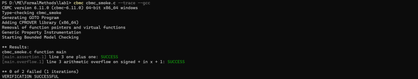
## 4. 实验任务

### 任务 1：测试整数中点计算函数

#### 1.1 自行选择并运行至少四组满足 `0 <= low <= high` 的输入。测试中应包含端点相等、端点不相等以及 `high - low` 为奇数和偶数的情况。根据数学上的整数中点确定正确结果，并记录程序的实际结果。

| 输入区间 | 覆盖情况 | 数学结果 | 实际结果 |
| :--- | :--- | :--- | :--- |
| [10,10] | 端点相等，差为偶数 | 10 | 10 |
| [10,20] | 端点不等，差为偶数 | 15 | 15 |
| [11,223] | 端点不等，差为偶数 | 117| 117 |
| [11,222] | 端点不等，差为奇数 | 116 | 116 |

**运行截图：**
![[10,10] 的运行结果](image-2.png)
![[10,20] 的运行结果](image-3.png)
![[11,223] 的运行结果](image-4.png)
![[11,222] 的运行结果](image-5.png)

#### 1.2 列出全部已运行的 `(low, high)`，并另外写出至少三组满足输入条件但没有运行的 `(low, high)`。根据这两组输入，说明当前测试结果能够支持哪些具体输入上的判断，尚不能判断哪些输入的结果。

**全部已运行的 (low, high)：** (10,10) ,(10,20),(11,223),(11,222)。

**满足输入条件但没有运行的 (low, high)：**
(0,0),(1120,3940),(1,99999)

**结论：** 四组实际输出均与数学结果一致，这说明当前测试支持程序在这四组具体输入上返回正确中点。不过，虽然测试覆盖了端点相等、不相等及区间长度奇偶的情况，但不能仅凭这些结果断言所有同类输入均正确，也不能排除较大整数输入导致溢出的可能。

### 任务 2：使用 CBMC 检查整数溢出
**运行下列命令，并查看结果：**
```powershell
cbmc midpoint_cbmc.c --signed-overflow-check --all-properties --trace --gcc
```
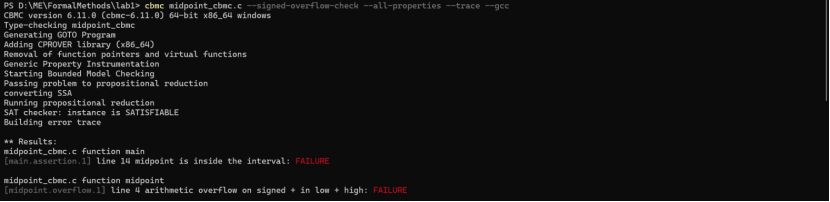
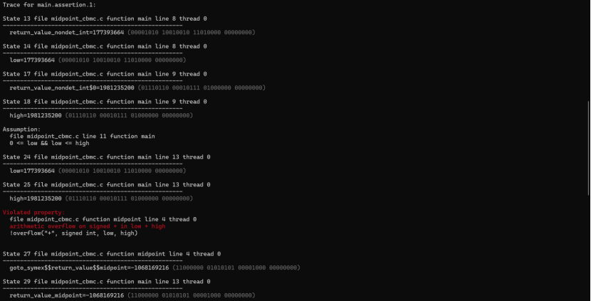
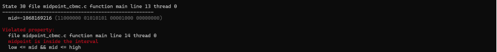
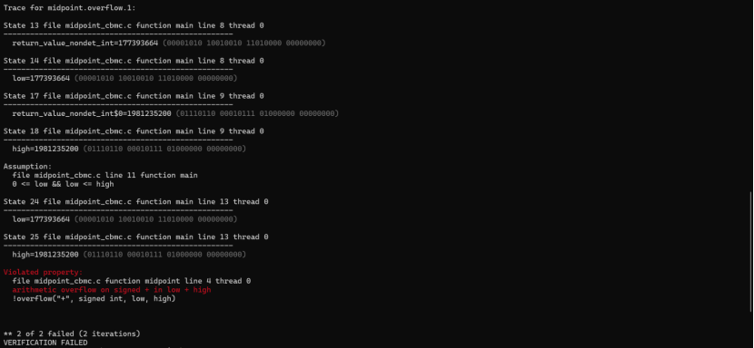
#### 2.1 在输出中找到 `low + high` 的有符号整数溢出性质，记录反例中的 low 和 high，并检查这两个数是否满足输入假设。
　　首先我们根据`[midpoint.overflow.1] line 4 arithmetic overflow on signed + in low + high: FAILURE`可以看出存在一组满足输入约束的 low 和 high，会使 low + high 发生有符号整数溢出。
　　我们向下查看，找到`Trace for midpoint.overflow.1:`CBMC在这里给出low=177393664，high=1981235200，所以溢出反例(low, high) = (177393664, 1981235200)。随后trace判断`Assumption:
0 <= low && low <= high`，可以看出这两个数满足输入假设。

#### 2.2  使用数学整数计算反例中的 `low + high` 和较小中点，说明为什么数学上的中点仍可由 int 表示，而程序在计算它之前已经发生溢出。
　　按照数学整数算，low + high = 2158628864，超过了32位有符号int的最大值(2147483647)，所以程序执行low + high时发生有符号整数溢出。而数学上的正确较小中点为1079314432，该结果仍可由int表示(< INT_MAX)，这说明错误来自中间加法，而不是最终中点超出范围。

#### 2.3  把反例中的 low 和 high 作为任务 1 程序的输入并实际运行，记录运行现象。说明普通运行的具体结果和 CBMC 判断“存在有符号整数溢出”分别告诉了你什么。

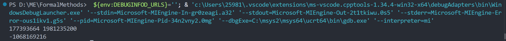
　　可以看到，程序的实际输出结果为-1068169216，它并不等于数学上的正确较小中点1079314432。而这个结果和trace中的结果一致， 这是由
2158628864 - 4294967296(2^32^) = -2136338432(对应的有符号数)，
-2136338432 / 2 = -1068169216(结果)计算得到的。
> 普通运行的具体结果说明该具体反例(177393664, 1981235200)在本次运行环境中产生了错误结果

> CBMC判断“存在有符号整数溢出”则说明在所有满足输入假设的取值中，存在有至少一组的合法输入会使low + high发生有符号整数溢出。

>**结论：**`nondet_int()`可以生成任意 int 类型的值，为`low`和`high`提供非确定输入；`__CPROVER_assume(0 <= low && low <= high)` 对输入增加约束，只保留满足条件的合法非负区间。而CBMC在该约束范围内，自动检查整数溢出与自定义的功能断言，一旦性质不成立，就会输出一组可以复现问题的具体反例。

*C语言中的有符号整数溢出属于未定义行为，其他编译环境不一定产生相同结果。by LLM*

### 任务 3：分别检查计算安全和功能要求
#### 3.1 重新运行任务 1 的全部测试，记录修正后的实际结果。再对修正后的 `midpoint_cbmc.c` 运行任务 2 的 CBMC 命令，分别记录所有有符号整数溢出性质、第一个功能断言和第二个功能断言的结果。
**①重新运行任务1：** 

| 输入区间 | 正确中点 | 修正前实际结果 | 修正后实际结果 |
| :---: | :---: | :---: | :---: |
| [10,10] | 10 | 10 | 10 |
| [10,20] | 15 | 15 | 15 |
| [11,223] | 117 | 117 | 117 |
| [11,222] | 116 | 116| 116 |

**运行截图：**
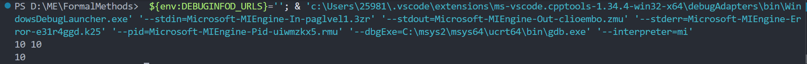
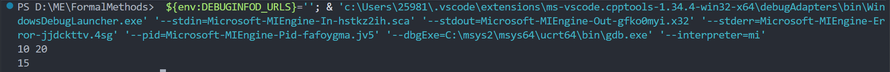
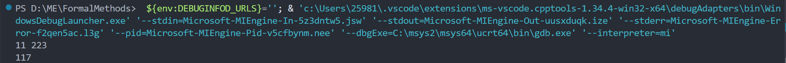
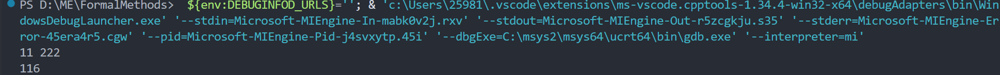

**②运行任务2的CBMC命令：** 
**运行截图：**
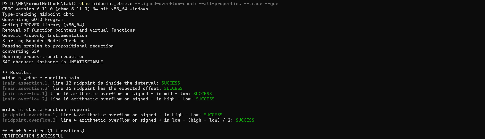
| 检查项目 | 性质编号或表达式 | 实际结果 |
| :--- | :--- | :--- |
| 所有有符号整数溢出性质 | `main.overflow.1`：`mid - low`；<br>`main.overflow.2`：`high - low`；<br>`midpoint.overflow.1`：`high - low`；<br>`midpoint.overflow.2`：`low + (high - low) / 2` | 全部 `SUCCESS`，均未溢出 |
| 第一个功能断言 | `main.assertion.1`：`low <= mid && mid <= high` | SUCCESS |
| 第二个功能断言 | `main.assertion.2`：`mid - low == (high - low) / 2` | SUCCESS |

#### 3.2 根据验证入口写明：low 和 high 可以取哪些值，输入假设排除了哪些调用，第一个断言检查什么，第二个断言检查什么。最后写出这次验证实际覆盖的输入条件和性质。

**low、high可以的取值：** 
　　因为low和high都是由nondet_int()产生的，所以取值范围为 `-2147483648 到 2147483647`。
**输入假设排除的调用：** 
　　排除了low < 0、high < 0以及low > high的调用
**第一个断言检查的内容：** 
　　检查最终结果是否仍在原区间(mid满足`0<=low<=mid<=high`)中
**第二个断言检查的内容：** 
　　检查mid与low之间的距离是否等于区间长度high - low的一半(当区间长度为奇数时会舍去小数部分)，即判断是否是中点
**实际覆盖的输入条件与性质：** 
　　实际输入条件覆盖了所有满足`0 <= low <= high`的32位有符号int输入组合。CBMC检查了`low + (high - low) / 2`中涉及的所有有符号减法和加法是否溢出，同时检查了返回值位于原区间内，以及返回值相对 low 的偏移量等于区间长度的一半这两个功能性质。
#### 3.3 暂时把 midpoint 改为下面这个不会计算 `low + high` 的版本，其它代码保持不变。然后重新运行 CBMC，分别记录所有有符号整数溢出性质和两个功能断言的结果。从失败的功能断言中提取一组 `(low, high, mid)`，分别计算 `low / 2`、`high / 2`、二者之和以及正确的较小中点，指出实际结果与正确结果的差异。完成后恢复正确实现。
```c
int midpoint(int low, int high) {
    return low / 2 + high / 2;
}
```
**输出结果：**
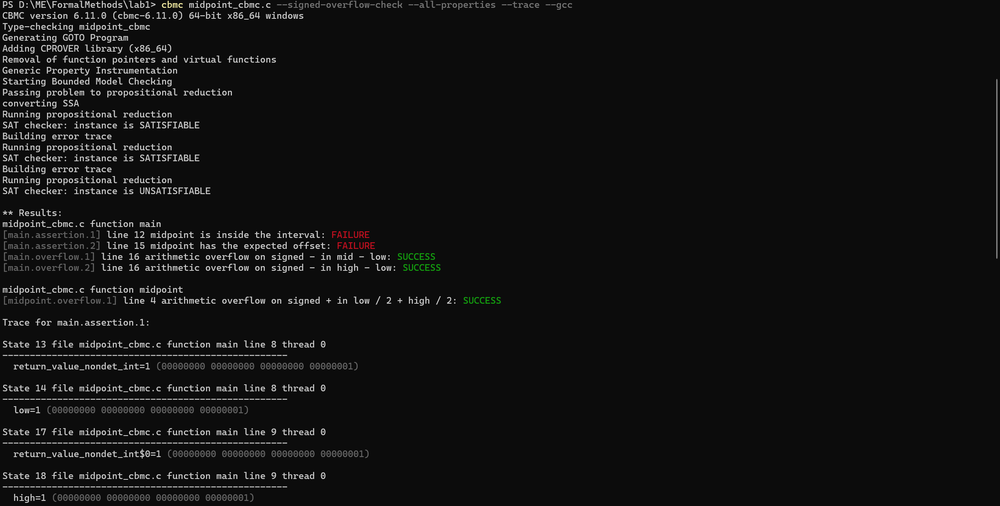
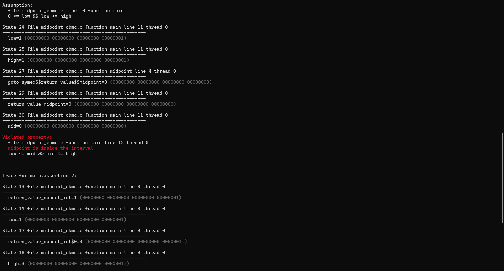
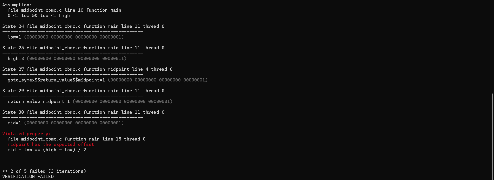

| 检查项目 | 性质编号或表达式 | 实际结果 |
| :--- | :--- | :--- |
| 所有有符号整数溢出性质 | `main.overflow.1`：`mid - low`；<br>`main.overflow.2`：`high - low`；<br>`midpoint.overflow.1`：`low / 2 + high / 2` | 全部 `SUCCESS`|
| 第一个功能断言 | `main.assertion.1`：`low <= mid && mid <= high` | `FAILURE` |
| 第二个功能断言 | `main.assertion.2`：`mid - low == (high - low) / 2` | `FAILURE` |


**失败的功能断言及反例 `(low, high, mid)`：**
1. 第一个断言给出的反例为 `(1, 1, 0)`：
   `low / 2 = 0`，`high / 2 = 0`。
   因此 `mid = low / 2 + high / 2 = 0`，不在区间 `[1,1]` 中，而正确的较小中点为 `1`。

2. 第二个断言给出的反例为 `(1, 3, 1)`：
   `low / 2 = 0`，`high / 2 = 1`。
   因此 `mid = low / 2 + high / 2 = 1`，`mid - low = 0`，而 `(high - low) / 2 = 1`，二者不相等。正确的较小中点为 `2`。

**整数除法计算与结果差异：** 
　　C语言中的整数除法会舍去小数部分。当`low`和`high`都是奇数时，分别计算`low / 2`和`high / 2`会各舍去0.5，两个被舍去的部分合计为 1，因此`low / 2 + high / 2`会比正确的较小中点小 1。
　　因此，即使该实现并没有计算`low + high`，也没有触发有符号整数溢出，依旧不能保证返回的是正确的较小中点。

*完成上述验证后，已将 midpoint 函数恢复为正确实现：low + (high - low) / 2。*

### 任务 4：比较软件测试与形式化验证
#### 4.1 从任务 1 中选择一组通过的普通测试，再写出任务 2 的溢出反例。确认两组输入都满足 `0 <= low <= high`，并根据这两个实际结果说明为什么前一组测试通过不能排除后一组输入上的错误。

| 输入来源 | (low, high) | 是否满足条件 | 对应的实际结果 |
| :--- | :--- | :--- | :--- |
| 任务 1 中通过的普通测试 | `(10, 20)` | 是 | 程序输出 `15`，与正确中点一致 |
| 任务 2 中的溢出反例 | `(177393664, 1981235200)` | 是，满足 `0 <= 177393664 <= 1981235200` | 程序输出 `-1068169216`，正确中点应为 `1079314432` |

> (10,20)通过只能说明原始程序对这一组具体输入返回了正确结果。该输入中的 low + high = 30，没有超过 int 的表示范围，因此没有触发溢出。但是，CBMC 找到的反例 (177393664,1981235200) 同样满足输入条件，其数学整数之和为 2158628864，超过了 32 位有符号 int 的最大值 2147483647，导致原始实现发生有符号整数溢出。因此，一组普通测试通过不能排除其他未测试合法输入上的错误。

#### 4.2 把任务 2 的反例输入加入固定回归测试集，写出修正后的正确结果，并说明这条测试用于防止哪一种错误再次出现。

*任务2中的反例：(low, high) = (177393664, 1981235200)*

修改midpoint_test.c代码，运行并查看结果：
```
#include <stdio.h>

int midpoint(int low, int high) {
 return low + (high - low) / 2;
}

int main(void) {
    int low;
    int high;
    if (scanf("%d%d", &low, &high) != 2) {
        return 1;
    }
    if (low < 0 || low > high) {
        puts("invalid input");
        return 0;
    }
    printf("%d\n", midpoint(low, high));

    /* 任务 2 的反例：固定回归测试 */
    int regression_low = 177393664;
    int regression_high = 1981235200;
    int expected = 1079314432;
    int actual = midpoint(regression_low, regression_high);
    printf("regression input: (%d, %d)\n", regression_low, regression_high);
    printf("expected: %d, actual: %d\n", expected, actual);
    printf("%s\n", actual == expected ? "PASS" : "FAIL");
    
    return 0;
}

```
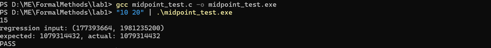

>预期结果为 1079314432，实际输出为 1079314432
>预期结果与实际结果一致，因此回归测试通过。

　　该回归测试用于防止 (low + high) / 2 中的有符号整数加法溢出问题再次出现，用于检查程序是否仍能返回正确结果。

#### 4.3 根据任务 3 的最终结果写出验证结论，结论中应明确包含：适用的输入条件、使用的整数类型、已经检查的溢出性质和两个功能性质，以及至少两项本实验没有检查的输入或程序行为。

***验证结论：***
**适用的输入条件：** 所有满足 `0 <= low <= high` 的输入。
**使用的整数类型及范围：** `low`、`high` 和 `mid` 均为32位有符号int类型，其取值范围为 `-2147483648 ~ 2147483647`。即`0 <= low <= high <= 2147483647`。
**已经检查的溢出性质：** 
1. 第二个功能断言中的 `mid - low` 是否发生有符号整数溢出；*main.overflow.1*
2. 第二个功能断言中的 `high - low` 是否发生有符号整数溢出；*main.overflow.2*
3. `midpoint` 函数中的 `high - low` 是否发生有符号整数溢出；*midpoint.overflow.1*
4. `midpoint` 函数中的 `low + (high - low) / 2` 是否发生有符号整数溢出。*midpoint.overflow.2*

**已经检查的两个功能性质：**
1. 返回值位于原闭区间内： `low <= mid && mid <= high`； *main.assertion.1*
2. 返回值相对 `low` 的偏移量等于区间长度的一半：`mid - low == (high - low) / 2`。 *main.assertion.2*

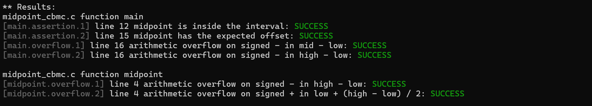

**未检查内容：**
　　本次验证没有检查`low < 0`、`high < 0`或`low > high`的调用，因为这些输入被`__CPROVER_assume(0 <= low && low <= high)`排除。
　　同样的，测试输入使用`nondet_int()` 直接产生整数，没有检查普通程序中的`scanf`输入失败、非数字输入和其他输入输出行为。
　　
**软件测试与形式化验证如何配合？**
　　由于软件测试通过实际运行程序来检查具体输入下的结果，很容易漏掉一些极端输入带来的隐藏问题；而形式化验证能在给定条件下检查所有满足输入假设的输入，找出人工测试很难想到的一些bug。
　　所以，我们可以先通过软件测试来检查常见功能是否正确，再用形式化验证扩大检查的范围，过程中发现的反例还可以加入回归测试，防止同类问题再次出现