# 实验 2：命题逻辑与 SAT 求解

**姓名：** 李文杰
**学号：** 10245101584

---
## 1. 实验主题
　　把软件⼯程约束转换为命题逻辑和 CNF，使⽤ **MiniSAT** 求解，并检查编码、模型和解空间是否符合原始需求。

## 2. 实验目标
- 使⽤ MiniSAT 求解布尔可满⾜性问题（Boolean satisfiability problem，**SAT**），区分可满⾜（SAT）与不可满⾜（UNSAT）结果。
- 把⾃然语⾔约束编码为**合取范式**（conjunctive normal form，CNF）和 DIMACS CNF ⽂件格式，并维护变量—语义映射。
- 从 MiniSAT 模型恢复领域解，并独⽴检查每条原始约束。
- 使⽤**阻塞⼦句**（blocking clause，即排除当前模型、迫使求解器寻找不同模型的⼦句）分析⽆解、多解与唯⼀解。
- 使⽤ C++ 函数检查具体赋值是否满⾜ CNF，并通过完整⽐较有限变量上的模型集合判断两份编码是否等价。

> 允许使⽤ LLM 协助候选编码和脚本编写，但所有模型、反例和等价性结论都必须通过 MiniSAT 实际运⾏或完整赋值检查独⽴核验。


## 3. ⼯具与参考资料
- MiniSAT 官⽅代码库
- SAT Competition：DIMACS CNF 说明
- 可选：任意脚本语⾔，⽤于⽣成 CNF、解析模型和枚举多个解。

## 4. 最⼩环境检查（Smoke Test）

### 4.1 MiniSAT
- 保存以下内容为 minisat_smoke.cnf：
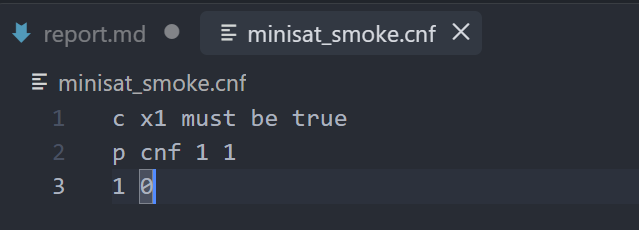
- 运⾏：
*1 power shell运行报错：*
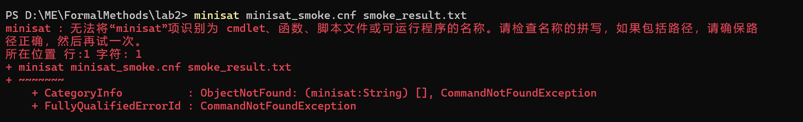
*2 在linux环境下运行：*
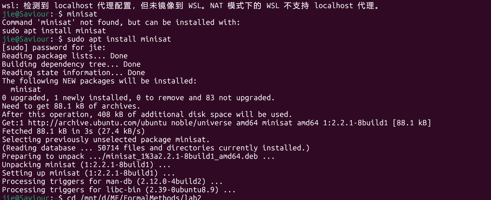
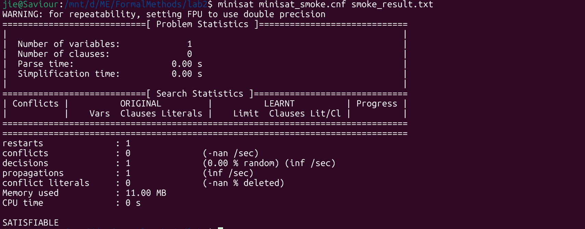
结果文件如下：
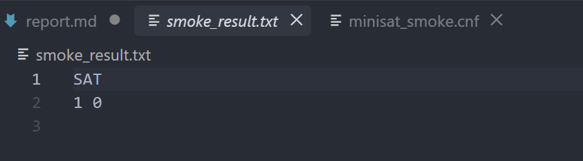
- 现在把唯⼀⼦句改为 -1 0 再运⾏，这次也得到 SAT，但模型中变量 1 为假：
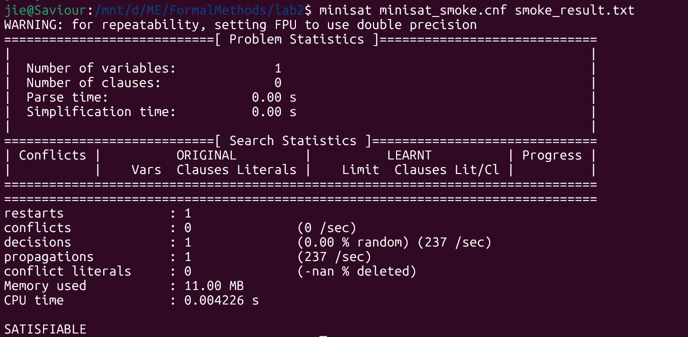
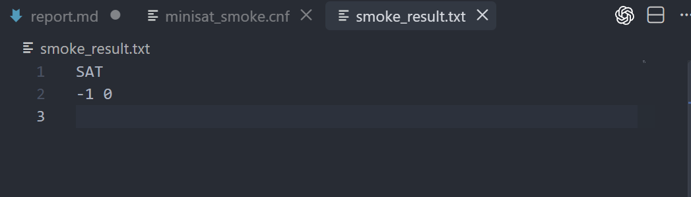

## 5. 实验任务

### 任务 1：DIMACS 读写与结果解释
**任务摘要：** 读懂⼀个软件运⾏模式配置问题的 DIMACS 编码，通过修改约束构造不同版本，并从模型或约束传播过程解释求解结果。某软件可以采⽤服务器模式或本地模式，并根据运⾏模式选择数据库或⽂件存储后端。
*定义变量如下：*
| 变量 | 编号 | 为真时的含义 |
| :--: | :--: | :--: |
| S    | 1    | 启用服务器模式 |
| L    | 2    | 启用本地模式 |
| D    | 3    | 启用数据库后端 |
| F    | 4    | 启用文件存储后端 |
| P    | 5    | 启用持久化功能 |

*配置规则如下：*
1. 服务器模式和本地模式⾄少启⽤⼀种。
2. 服务器模式要求数据库后端。
3. 本地模式要求⽂件存储后端。
4. 数据库后端要求启⽤持久化功能。
5. ⽂件存储后端要求启⽤持久化功能。
6. 启⽤持久化功能时，⾄少启⽤⼀种存储后端。
7. 数据库后端与⽂件存储后端不能同时启⽤。
8. 当前产品版本要求启⽤持久化功能。

保存以下内容为 base.cnf：
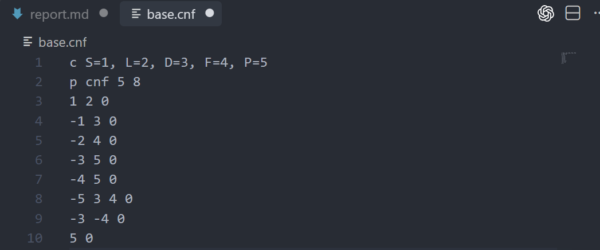

#### 1.1 把⼋条业务规则分别写成命题逻辑公式，并建⽴“规则编号—逻辑公式—DIMACS ⼦句”对照表；同时检查 base.cnf 的⽂件头、变量编号、⼦句数量和结尾的 0。
- **文件的第一行是注释，规定编号**：c S=1, L=2, D=3, F=4, P=5。每个变量只有`true`与`false`两种取值，
- 第二行p cnf 5 8则表示**这个问题一共有5个变量，8条子句**。下面的每一行都是一条必须满足的要求；
- CNF 的规则是：同一行中的文字用“或”连接，各行之间用“且”连接。 负号表示“非”，**0 表示该子句结束**。

|规则编号|逻辑公式|DIMACS子句|规则含义|
|:-:|:-:|:-:|:-:|
|1|\(S\lor L\)|1 2 0|服务器模式和本地模式⾄少启⽤⼀种|
|2|\(S\rightarrow D\)|-1 3 0|服务器模式要求数据库后端|
|3|\(L\rightarrow F\)|-2 4 0|本地模式要求⽂件存储后端|
|4|\(D\rightarrow P\)|-3 5 0|数据库后端要求启⽤持久化功能|
|5|\(F\rightarrow P\)|-4 5 0|⽂件存储后端要求启⽤持久化功能|
|6|\(P\rightarrow (D \lor F)\)|-5 3 4 0|启⽤持久化功能时，⾄少启⽤⼀种存储后端|
|7|\(\neg(D\land F)\)|-3 -4 0|数据库后端与⽂件存储后端不能同时启⽤|
|8|P|5 0|当前产品版本要求启⽤持久化功能|

- **持久化：** 把数据保存下来，程序退出后数据仍然保留。
- \(\neg S \lor D\) 等价于 \(S\rightarrow D\)
- \(\neg P \lor D \lor F\) 等价于 \(\neg P \lor (D \lor F)\) 等价于 \(P\rightarrow (D \lor F)\)
- \(\neg D \lor \neg F\) 等价于 \(\neg(D\land F)\)

#### 1.2 运⾏ base.cnf，解读 MiniSAT 的终端输出和结果⽂件：说明求解状态表⽰什么，解释模型中正、负变量编号的含义，把模型还原为软件配置，并逐条检查该配置是否满⾜⼋条业务规则。
*终端输出：*
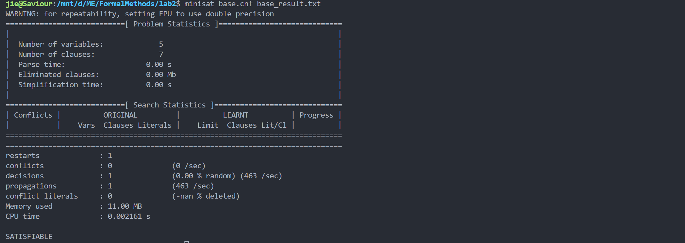
problem statistics:

*结果文件：*
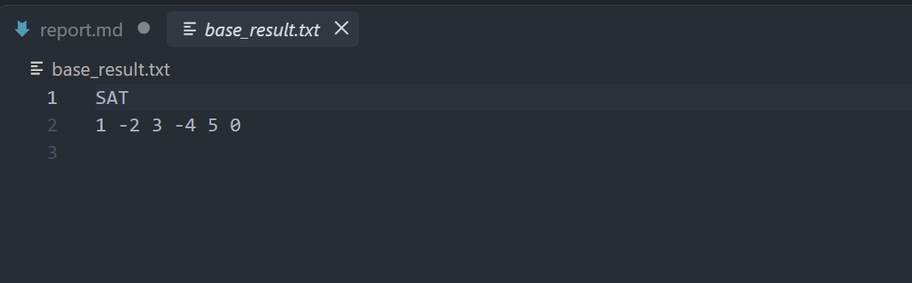

> SAT表示存在满足全部约束的赋值，正数代表变量为真，负数则为假，结尾的0是结束标记

`S=1, L=-2, D=3, F=-4, P=5`表示启用服务器模式，关闭本地模式，启用数据库后端，关闭文件存储后端，启用持久化功能。即：启用服务器模式、数据库后端和持久化功能，关闭本地模式和文件存储后端。

代入一下`base.cnf`，也确实满足八条业务规则：
|规则编号|DIMACS子句|使子句为真的关键变量|
|:-:|:-:|:-:|
|1|1 2 0|1|
|2|-1 3 0|3|
|3|-2 4 0|-2|
|4|-3 5 0|5|
|5|-4 5 0|-4，5|
|6|-5 3 4 0|3|
|7|-3 -4 0|-4|
|8|5 0|5|

#### 1.3 分别构造并运⾏两个变体：在基础⽂件`base.cnf`中增加单元⼦句 1 0 得到`server_only.cnf`，表⽰必须启⽤服务器模式；把基础⽂件最后的 5 0 改为 -5 0 得到`no_persistence.cnf`，表⽰禁⽌持久化。正确更新⽂件头，并⽐较三个版本的求解状态和模型变化。
- **server_only.cnf**:
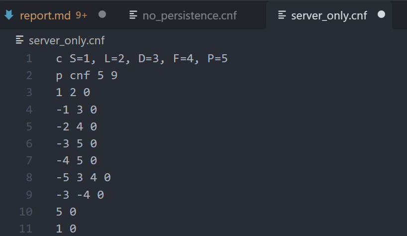
运行结果如下：
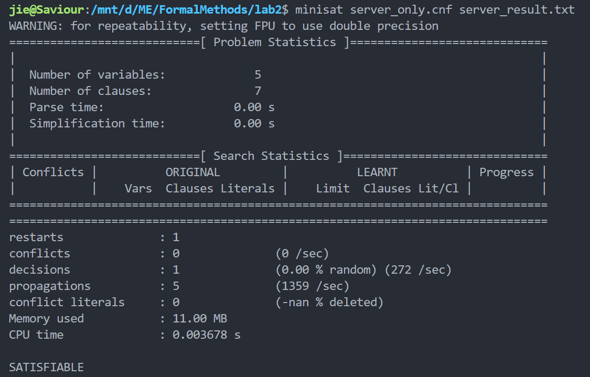
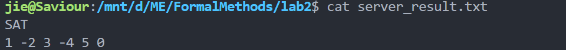

- **no_persistence.cnf**:
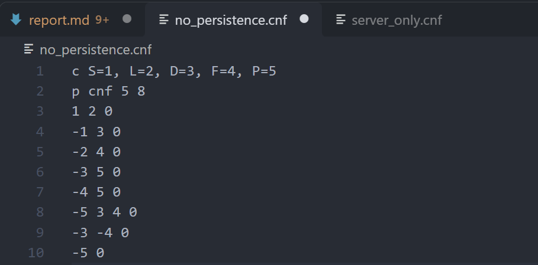
运行结果如下：
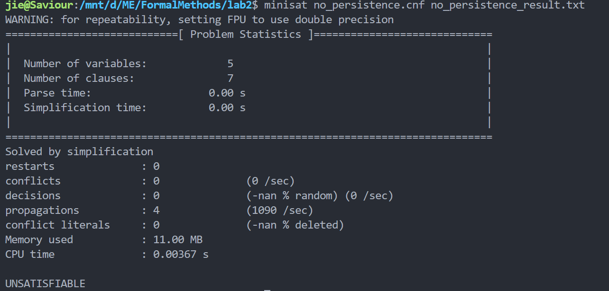
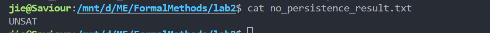

- **三个版本的求解状态和模型变化**：

| 版本 | 变化 | 求解状态 | 输出模型 | 对应的配置 |
|:---:|:---:|:---:|:---:|:---:|
| `base.cnf` | 原始八条规则 | SAT | `1 -2 3 -4 5 0` | 启用服务器、数据库和持久化；关闭本地模式和文件存储 |
| `server_only.cnf` | 新增`1 0`，必须启用服务器模式 | SAT | `1 -2 3 -4 5 0` | 与基础版本输出的配置相同 |
| `no_persistence.cnf` | 将`5 0`替换为`-5 0`，禁止持久化 | UNSAT | 无满足模型 | 不存在满足全部约束的配置 |

> 因为base版本找到的模型满足server_only版本新增的约束1 0，所以二者输出模型一致。
> *但输出相同不表示约束没有作用*：base版本允许本地模式方案，服务器版本将其排除了，因此合法配置的范围缩小了。

> 对于no_persistence版本：求解状态由SAT变为UNSAT。
> 禁止持久化后，数据库和文件存储都不能启用，进而导致服务器模式和本地模式都不能启用，而规定要求至少启用一种运行模式，*所以发生了冲突*。
> 因此，该版本没有满足模型。

#### 1.4. 对`no_persistence.cn`，按照“持久化—存储后端—运⾏模式”的顺序解释为什么约束最终发⽣冲突，并列出这条冲突链实际使⽤的业务规则。
- **原因：**
在**禁用持久化**之后，由于**规则4、5**（*数据库后端/文件存储后端要求启用持久化功能*）导致数据库/文件这**两种存储后端无法启用**，进一步根据**规则2、3**（*服务器模式要求数据库后端/本地模式要求文件存储后端*）导致服务器和本地这**两种运行模式都不能启用**，这进一步违反了**规则1**（*服务器模式和本地模式⾄少启⽤⼀种*）。
- **冲突链：**
\(\neg P\) -> 
规则④ \(\neg D\) -> 规则② \(\neg S\)
规则⑤ \(\neg F\) -> 规则③ \(\neg L\)
-> 与规则①\(S\lor L\)冲突 
***实际使⽤的业务规则:*** 规则①、②、③、④、⑤。

**求解结果为什么必须结合变量语义和约束关系解释：**
`MiniSAT`输出`SAT/UNSAT`和正负编号,但是只有结合变量对照表才能知道其代表的具体含义和满足的业务规则：
> `SAT`意味着存在满足所有约束的取值，但具体启用了哪些功能要靠变量映射才能确定；
> `UNSAT`意味着存在冲突的约束关系，但是冲突来自哪几条规则也要顺着约束链倒推。

如果不结合变量语义和约束关系，求解结果就只是无意义的数字，没有具体的作用。

### 任务 2：诚实者与说谎者建模
**任务摘要：** 把⼈物陈述转换为命题逻辑，判断问题是⽆解、唯⼀解还是多解，并解释判断依据。
*场景如下：*
Alice 说“Bob 与 David ⾝份不同”；
Bob 说“Alice 或 David 中⾄少⼀⼈诚实”；
Carol 说“Alice 是说谎者”；
David 说“Alice 或 Bob 中⾄少⼀⼈诚实”；
Eve 说“Carol 是诚实者”。
另有“⾄少两名诚实者、⾄少两名说谎者”。

#### 2.1. 明确区分“某⼈诚实”和“某⼈的陈述为真”，⽤等价关系表达⾝份规则，再转换为 CNF。
##### 2.1.1 建模：
- 令A,B,C,D,E分别表示：Alice, Bob, Carol, David, Eve是诚实者。
- 同样地，\(\neg A\), \(\neg B\), \(\neg C\), \(\neg D\), \(\neg E\)分别表示：Alice, Bob, Carol, David, Eve是说谎者。
- 令$T_A, T_B, T_C, T_D, T_E$分别表示：Alice, Bob, Carol, David, Eve的陈述为真，反之则为假。
##### 2.1.2 身份规则：
**身份规则：** 某人诚实当且仅当其陈述为真。所以有：\(A\leftrightarrow T_A, B\leftrightarrow T_B, C\leftrightarrow T_C, D\leftrightarrow T_D, E\leftrightarrow T_E\) 。

*代入陈述内容可得：*
| 人物 | 陈述 | 陈述的逻辑表达式 |
|---|---|---|
| Alice | Bob 与 David 身份不同 | \(A\leftrightarrow (B ∧ \neg D) ∨ (\neg B ∧ D)\) |
| Bob | Alice 或 David 至少一人诚实 | \(B\leftrightarrow A ∨ D\) |
| Carol | Alice 是说谎者 | \(C\leftrightarrow \neg A\) |
| David | Alice 或 Bob 至少一人诚实 | \(D\leftrightarrow A ∨ B\) |
| Eve | Carol 是诚实者 | \(E\leftrightarrow C\) |

##### 2.1.3 CNF：
**①身份与陈述约束的 CNF：**

**Alice:**
令\(Q=(B\land\neg D)\lor(\neg B\land D)\)
$\equiv$ \((B\lor\neg B)\land(B\lor D)\land(\neg D\lor\neg B)\land(\neg D\lor D)\)
$\equiv$ \((B\lor D)\land(\neg D\lor\neg B)\),

\(\neg Q\)
$\equiv$ \(\neg((B\land\neg D)\lor(\neg B\land D))\)
$\equiv$ \(\neg(B\land\neg D)\land\neg(\neg B\land D)\)
$\equiv$ \((\neg B\lor D)\land(B\lor\neg D)\),

\(A\leftrightarrow (B\land \neg D)\lor(\neg B\land D)\)
$\equiv$ \((A\rightarrow Q)\land(Q\rightarrow A)\)
$\equiv$ \((\neg A\lor Q)\land(\neg Q\lor A)\)
$\equiv$ \((\neg A\lor((B\lor D)\land(\neg B \lor \neg D)))\land(A\lor((\neg B\lor D)\land(B\lor \neg D)))\)
$\equiv$ \((\neg A\lor B\lor D)\land(\neg A\lor\neg B\lor\neg D)\land(A\lor\neg B\lor D)\land(A\lor B\lor\neg D).\)
*如果Alice诚实，那么Bob、David至少一人诚实；*
*如果Alice诚实，那么Bob、David至少一人说谎；*
*如果Alice说谎且Bob诚实，那么David一定诚实；*
*如果Alice说谎且David诚实，那么Bob一定诚实；*

**Bob:**
\(B\leftrightarrow A ∨ D\)
$\equiv$ \((B\rightarrow (A\lor D))\land((A\lor D)\rightarrow B)\)
$\equiv$ \((B\rightarrow (A\lor D))\land(\neg(A\lor D)\lor B)\)
$\equiv$ \((\neg B\lor A\lor D)\land(B\lor\neg A)\land(B\lor\neg D).\)
*如果Bob诚实，那么Alice、David至少一人诚实*
*如果Bob说谎，那么Alice一定说谎*
*如果Bob说谎，那么David一定说谎*

**Carol:**
\(C\leftrightarrow \neg A\)
$\equiv$ \((C\rightarrow \neg A)\land(\neg A\rightarrow C)\)
$\equiv$ \((\neg C\lor \neg A)\land(A\lor C)\)
*如果Carol诚实，那么Alice一定说谎*
*如果Carol说谎，那么Alice一定诚实*

**David:** 
\(D\leftrightarrow A ∨ B\)  *同Bob*
$\equiv$ \((\neg D\lor A\lor B)\land(D\lor\neg A)\land(D\lor\neg B).\)
*如果David诚实，那么Alice、Bob至少一人诚实*
*如果David说谎，那么Alice一定说谎*
*如果David说谎，那么Bob一定说谎*

**Eve:**
\(E\leftrightarrow C\)
$\equiv$ \((E\rightarrow C)\land(C\rightarrow E)\)
$\equiv$ \((\neg E\lor C)\land(\neg C\lor E)\)
*如果Eve诚实，那么Carol一定诚实*
*如果Eve说谎，那么Carol一定说谎*

**②人数约束的 CNF：**

**⾄少两名诚实者：**
\((A\lor B\lor C\lor D)\land(A\lor B\lor C\lor E)\land(A\lor B\lor D\lor E)\land(A\lor C\lor D\lor E)\land(B\lor C\lor D\lor E)\)
*一共5人，⾄少2人诚实，即至多3人说谎，所以任选4人一定有诚实者*

**⾄少两名说谎者：**
\((\neg A\lor\neg B\lor\neg C\lor\neg D)\land(\neg A\lor\neg B\lor\neg C\lor\neg E)\land(\neg A\lor\neg B\lor\neg D\lor\neg E)\land(\neg A\lor\neg C\lor\neg D\lor\neg E)\land(\neg B\lor\neg C\lor\neg D\lor\neg E)\)
*一共5人，⾄少2人说谎，即至多3人诚实，所以任选4人至少有1位说谎者*

#### 2.2. 运⾏ MiniSAT。如果找到⼀个模型，加⼊排除该模型的阻塞⼦句并再次求解，根据两次求解结果判定原问题是唯⼀解还是多解；如果第⼀次就是 UNSAT，则判定原问题⽆解，并从⼈物陈述的逻辑关系中解释⼀组直接冲突。
*由2.1可知，一共有24条子句。*
*其中：**Alice**: 4; **Bob**: 3; **Carol**: 2; **David**: 3; **Eve**: 2;**⾄少两名诚实者**: 5; **⾄少两名说谎者**: 5。*

按`A=1,B=2,C=3,D=4,E=5`(负数表示是说谎者)编号，把上述子句转化为DIMACS⼦句，保存在`honesty.cnf`文件中：
```cnf
c A=1, B=2, C=3, D=4, E=5
p cnf 5 24

c Alice
-1 2 4 0
-1 -2 -4 0
1 -2 4 0
1 2 -4 0

c Bob
1 -2 4 0
-1 2 0
2 -4 0

c Carol
-1 -3 0
1 3 0

c David
1 2 -4 0
-1 4 0
-2 4 0

c Eve
3 -5 0
-3 5 0

c At least two honest people
1 2 3 4 0
1 2 3 5 0
1 2 4 5 0
1 3 4 5 0
2 3 4 5 0

c At least two liars
-1 -2 -3 -4 0
-1 -2 -3 -5 0
-1 -2 -4 -5 0
-1 -3 -4 -5 0
-2 -3 -4 -5 0
```
- 运行miniSAT:
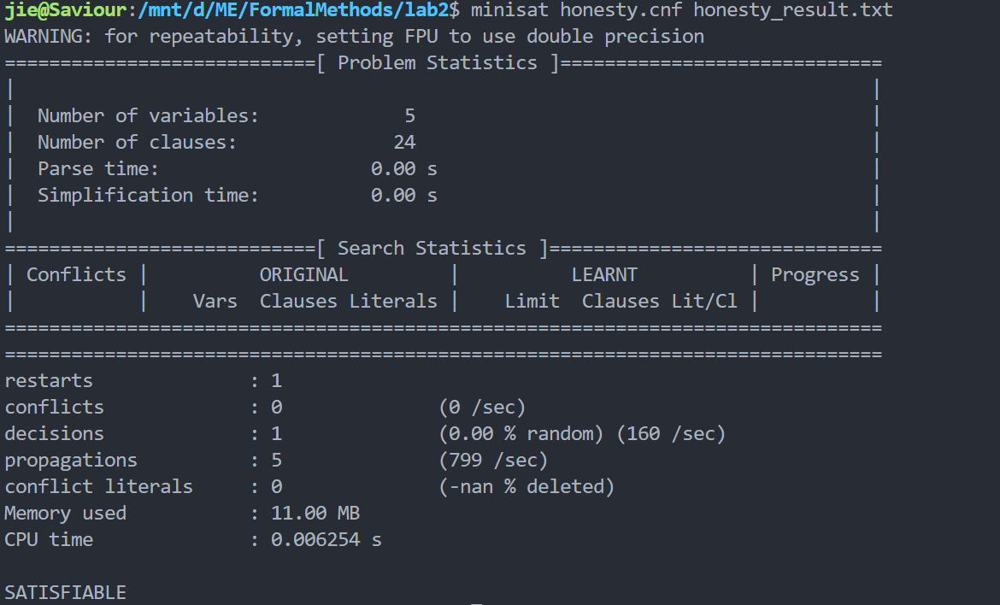
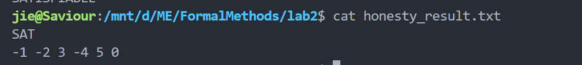
- 加入排除`-1 -2 3 -4 5 0`答案的阻塞⼦句（`honesty_blocked.cnf`）后再次求解：
>把`p cnf 5 24`改为`p cnf 5 25`，在最后加上一行`1 2 -3 4 -5 0`。
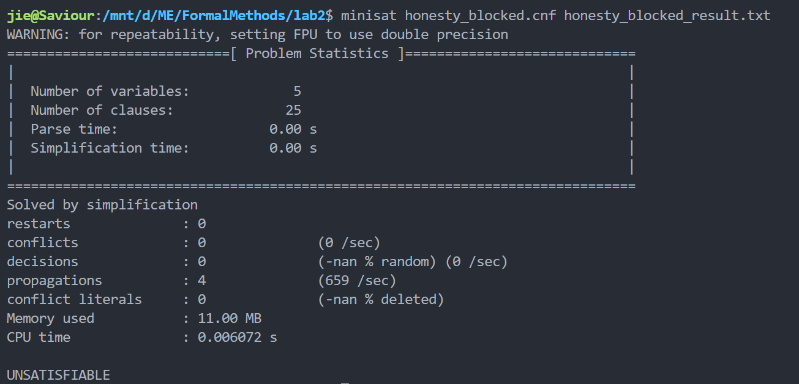


至此可以得到：本题有**唯一解**：Alice、Bob、David是说谎者，Carol、Eve是诚实者，对应模型为：`-1 -2 3 -4 5 0`，该配置满足五人的身份与陈述之间的等价关系，并且包含两名诚实者、三名说谎者，满足人数约束。

### 任务 3：⾃选场景的 SAT 建模
**任务摘要：** 使⽤ LLM 为⾃选的软件⼯程场景⽣成 SAT 模型，整理⾃然语⾔需求与 CNF ⼦句的对应关系，再使⽤ MiniSAT 求解。
> 从软件配置、测试⽤例选择、课程冲突或资源分配中选择⼀个场景。最终模型应包含不少于 10 个有业务含义的布尔变量和 15 个 CNF ⼦句，并⾄少包含依赖、互斥、⾄少⼀个、⾄多⼀个和条件组合中的三类关系。最终需求应当⾄少允许⼀个合法⽅案。
#### 3.1. 编写提⽰词，让 LLM ⽣成场景说明、变量含义、编号后的⾃然语⾔需求、对应的 CNF ⼦句，以及⼀份满⾜全部需求的候选⽅案。提⽰词中应写明上述规模和可满⾜性要求。保存你实际提供给 LLM 的完整提⽰词。
**SelectClassPrompt.txt:** 
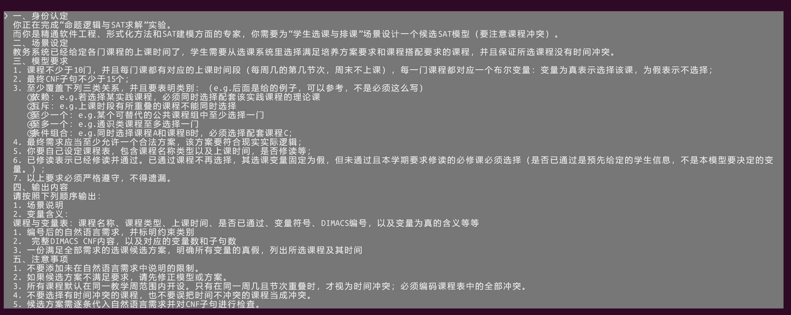
#### 3.2. 整理并检查 LLM ⽣成的模型，修正不合理或不⼀致的内容，形成最终的“⾃然语⾔需求—CNF ⼦句”对照，并把候选⽅案逐条代⼊最终需求和 CNF 检查。
##### 3.2.1 输出结果：

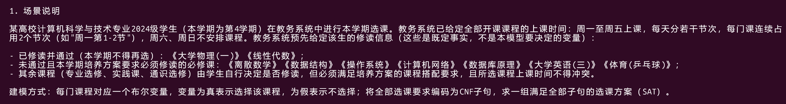
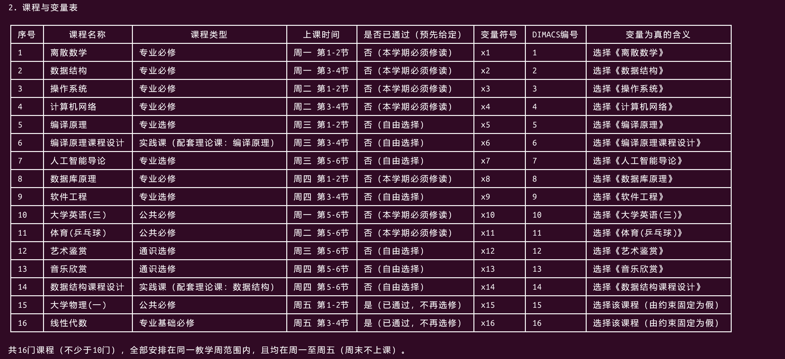
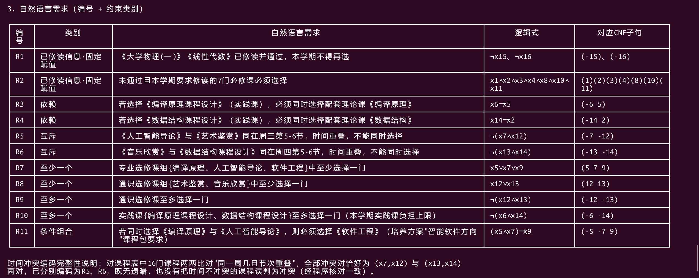
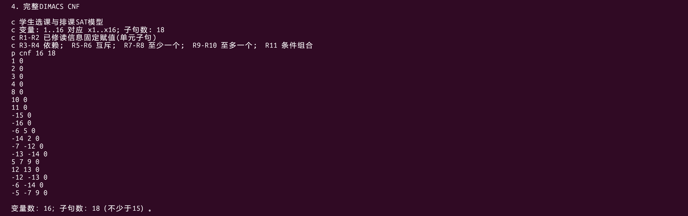
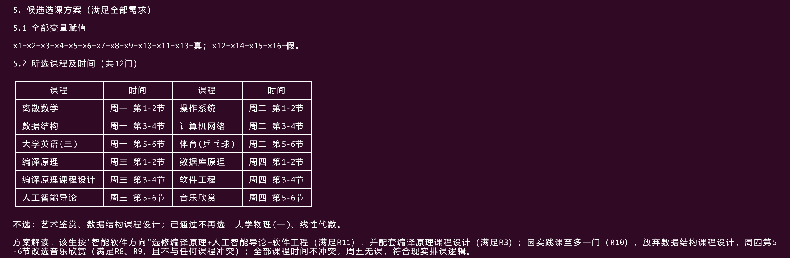
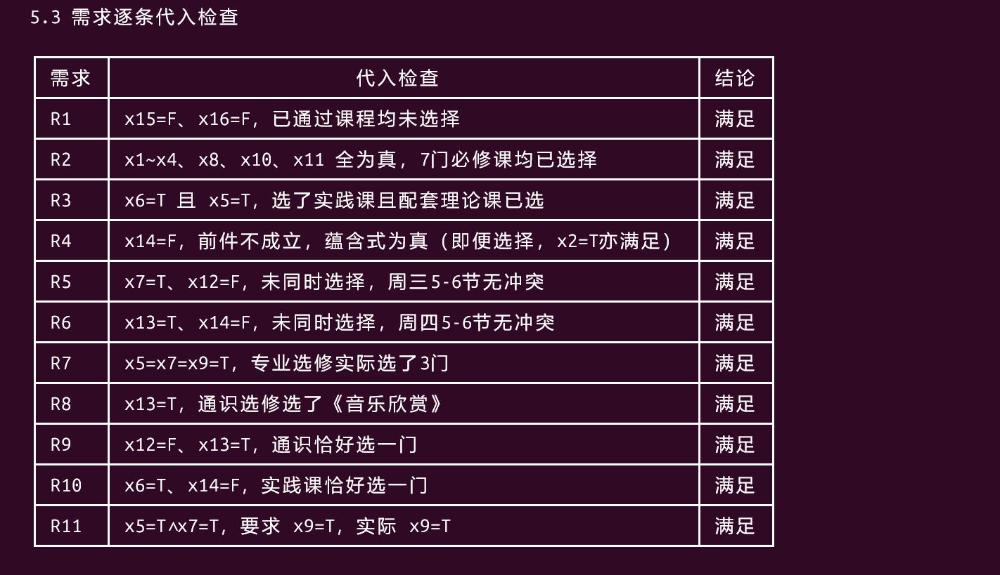
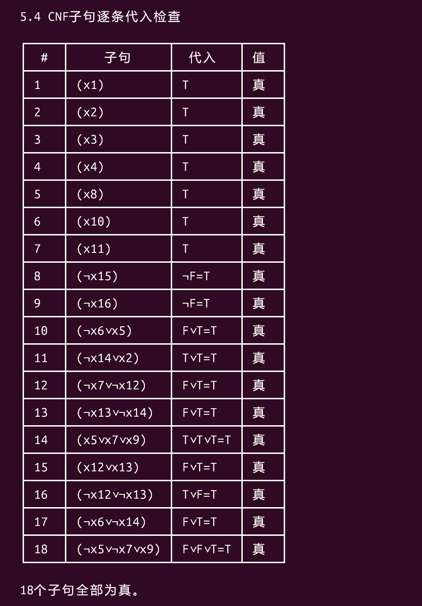
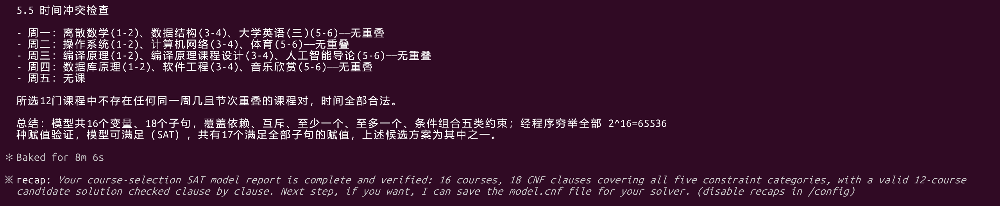
##### 3.2.2 整理与检查：
| 检查项目 | 当前模型 | 检查结果 |
|---|---|---|
| 变量数量不少于10 | 16个变量，各对应一门课程 | 满足 |
| 子句数量不少于15 | 18条子句，文件头为 `p cnf 16 18` | 满足 |
| 至少三类关系 | 依赖、互斥、至少一个、至多一个、条件组合 | 满足 |
| 变量含义一致 | 真表示选择，假表示不选择；是否已通过是已知信息 | 一致 |
| 已通过课程不再选择 | `-15 0`、`-16 0` | 正确 |
| 必修课程必须选择 | x1、x2、x3、x4、x8、x10、x11 被固定为真 | 正确 |
| 时间冲突编码完整 | x7与x12、x13与x14 两对冲突均已编码 | 正确 |
##### 3.2.3 最终的“⾃然语⾔需求—CNF ⼦句”对照：
| 需求 | 自然语言要求 | DIMACS 子句 |
|---|---|---|
| R1 | 两门已通过课程不再选择 | `-15 0`；`-16 0` |
| R2 | 七门本学期必修课必须选择 | `1 0`；`2 0`；`3 0`；`4 0`；`8 0`；`10 0`；`11 0` |
| R3 | 编译原理课程设计依赖编译原理 | `-6 5 0` |
| R4 | 数据结构课程设计依赖数据结构 | `-14 2 0` |
| R5 | 人工智能导论与艺术鉴赏时间冲突 | `-7 -12 0` |
| R6 | 音乐欣赏与数据结构课程设计时间冲突 | `-13 -14 0` |
| R7 | 三门专业选修课至少选择一门 | `5 7 9 0` |
| R8 | 两门通识选修课至少选择一门 | `12 13 0` |
| R9 | 两门通识选修课至多选择一门 | `-12 -13 0` |
| R10 | 两门实践课至多选择一门 | `-6 -14 0` |
| R11 | 同选编译原理和人工智能导论时，必须选择软件工程 | `-5 -7 9 0` |
##### 3.2.4 把候选⽅案逐条代⼊最终需求和CNF检查：
LLM给出的方案：
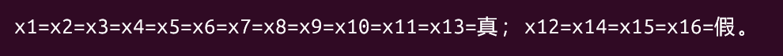
带入3.2.3的表格：
| 需求 | 自然语言要求 | DIMACS 子句 | 结果 |
|---|---|---|---|
| R1 | 两门已通过课程不再选择 | `-15 0`；`-16 0` | T; T |
| R2 | 七门本学期必修课必须选择 | `1 0`；`2 0`；`3 0`；`4 0`；`8 0`；`10 0`；`11 0` | T; T; T; T; T; T; T; |
| R3 | 编译原理课程设计依赖编译原理 | `-6 5 0` | \(F\lor T\) = T |
| R4 | 数据结构课程设计依赖数据结构 | `-14 2 0` | \(T\lor T\) = T |
| R5 | 人工智能导论与艺术鉴赏时间冲突 | `-7 -12 0` | \(F\lor T\) = T |
| R6 | 音乐欣赏与数据结构课程设计时间冲突 | `-13 -14 0` | \(F\lor T\) = T |
| R7 | 三门专业选修课至少选择一门 | `5 7 9 0` | \(T\lor T\lor T\) = T |
| R8 | 两门通识选修课至少选择一门 | `12 13 0` | \(F\lor T\) = T|
| R9 | 两门通识选修课至多选择一门 | `-12 -13 0` | \(T\lor F\) = T |
| R10 | 两门实践课至多选择一门 | `-6 -14 0` | \(F\lor T\) = T |
| R11 | 同选编译原理和人工智能导论时，必须选择软件工程 | `-5 -7 9 0` | \(F\lor F\lor T\) = T |
#### 3.3. 将最终 CNF 写成 DIMACS ⽂件并使⽤ MiniSAT 求解，把求得的模型还原为业务⽅案并逐条检查需求。若MiniSAT 报告 UNSAT，应检查需求或编码并修正，直到最终提交的模型可满⾜。
##### 3.3.1 将最终 CNF 写成 DIMACS ⽂件:
**selection.cnf:**
```cnf
c 学生选课与排课SAT模型
c 变量: 1..16 对应 x1..x16
p cnf 16 18
1 0
2 0
3 0
4 0
8 0
10 0
11 0
-15 0
-16 0
-6 5 0
-14 2 0
-7 -12 0
-13 -14 0
5 7 9 0
12 13 0
-12 -13 0
-6 -14 0
-5 -7 9 0
```
##### 3.3.2 使⽤ MiniSAT 求解:
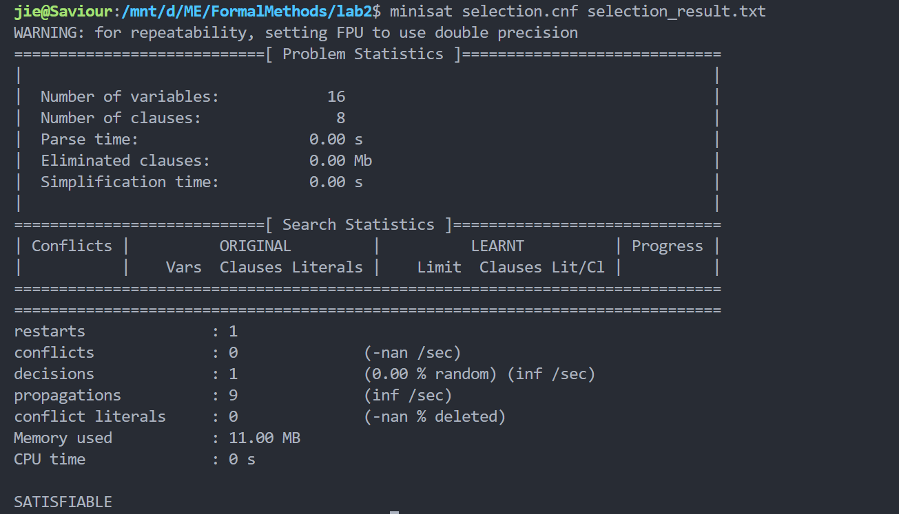
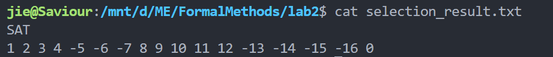
##### 3.3.3 把求得的模型还原为业务⽅案并逐条检查需求：
*可以看到，这个结果不同于LLM给出的结果（`1 2 3 4 5 6 7 8 9 10 11 -12 13 -14 -15 -16 0`），这说明该模型不止唯一解。*
主要区别是：
| 项目 | LLM 候选方案 | MiniSat 运行结果 |
|---|---|---|
| 专业选修 | 编译原理、人工智能导论、软件工程 | 软件工程 |
| 实践课 | 编译原理课程设计 | 不选实践课 |
| 通识选修 | 音乐欣赏 | 艺术鉴赏 |
| 总课程数 | 12 门 | 9 门 |

现在我们把miniSAT的结果还原为业务方案并逐条检查：
| 需求 | 自然语言要求 | 实际方案检查 | 结果 |
|---|---|---|---|
| R1 | 已通过课程不再选 | x15、x16均为假 | 满足 |
| R2 | 七门必修课必须选 | x1、x2、x3、x4、x8、x10、x11均为真 | 满足 |
| R3 | 编译实践依赖理论 | x6为假，未选择该实践课，不触发要求 | 满足 |
| R4 | 数据结构实践依赖理论 | x14为假，不触发要求 | 满足 |
| R5 | 人工智能与艺术鉴赏互斥 | x7为假、x12为真 | 满足 |
| R6 | 音乐欣赏与数据结构实践互斥 | x13、x14均为假 | 满足 |
| R7 | 专业选修至少一门 | 已选择x9 | 满足 |
| R8 | 通识选修至少一门 | 已选择x12 | 满足 |
| R9 | 通识选修至多一门 | 仅选择x12 | 满足 |
| R10 | 实践课至多一门 | 实际选择零门 | 满足 |
| R11 | 同选编译原理和人工智能时须选软件工程 | x5、x7均为假，条件未触发 | 满足 |

综上，最终CNF能够正确表达需求。

### 任务 4（编程题）：实现 CNF 赋值检查器
**任务摘要：** 按照固定接⼝实现⼀个 C++ 函数，判断给定布尔赋值是否满⾜⼀组 CNF ⼦句，并观察⼀次单变量翻转怎样使具体⼦句失效。
- 请在`lab2_solution.cpp`中实现以下函数：
```c++
#include <vector>

bool satisfiesCnf(
 int variableCount,
 const std::vector<std::vector<int>>& clauses,
 const std::vector<int>& assignment) {
 // 在此处完成实现
}
```
**接⼝约定：**
- 变量编号为1到variableCount。
- assignment恰好包含variableCount个元素；
  assignment[i]表⽰变量i + 1的值，只可能为0或1。
- 正整数⽂字表⽰对应变量为真，负整数⽂字表⽰对应变量为假。
- 每个⼦句⾄少包含⼀个⽂字，且⽂字的绝对值不超过variableCount。
- 只有每个⼦句都⾄少有⼀个⽂字为真时，函数才返回true。
- 函数不得调⽤MiniSAT，不得定义main，不得进⾏标准输⼊输出；评分程序将使⽤C++17编译并直接调⽤该函数。

#### 4.1. 实现satisfiesCnf，正确处理正⽂字、负⽂字、单⽂字⼦句和多个⼦句。
`lab2_solution.cpp`:
```c++
#include <vector>
bool satisfiesCnf(
    int variableCount,//变量总数
    const std::vector<std::vector<int>>& clauses,//子句
    const std::vector<int>& assignment) {//保存变量的真假值
    //遍历所有的子句
    for(const auto& clause : clauses){//clause：本轮循环取出的一个子句;auto：让编译器自动推断类型
        bool clauseSatisfied = false;//假设这个子句目前是不满足的
        //遍历当前子句中的所有文字
        for(int literal : clause){//literal是当前取出的一个整数文字。
            int variable = literal > 0 ? literal : -literal;//取出文字对应的变量编号
            bool value = assignment[variable - 1] == 1;//读取该变量的真假值
            bool literalSatisfied = literal > 0 ? value : !value;//根据正负号计算文字的真假
            if(literalSatisfied){//判断这个布尔变量是否为真
                clauseSatisfied = true;
                break;
            }
        }
        if(!clauseSatisfied){
              return false;
        }
    }
    return true;
}
```
#### 4.2. ⾃⾏设计⾄少六个测试，其中应包含满⾜赋值和不满⾜赋值。
| 编号 | `variableCount` | `clauses` | `assignment` | 预期结果 | 原因 |
|:-:|:-:|:-:|:-:|:-:|:-:|
| 1 | 1 | {1} | {1} | `true` | \(x_1\) 为真 |
| 2 | 1 | {1} | {0} | `false` | \(x_1\) 为假 |
| 3 | 1 | {-1} | {0} | `true` | \(x_1\) 为假，所以 \(\neg x_1\) 为真 |
| 4 | 1 | {-1} | {1} | `false` | \(x_1\) 为真，所以 \(\neg x_1\) 为假 |
| 5 | 3 | {1,-2},{-1,3},{2,3} | {1,0,1} | `true` | 三个子句都满足 |
| 6 | 3 | {1,-2},{-1,3},{2,3} | {1,0,0} | `false` | 第二、第三个子句均不满足 |

新增`test_42.cpp`
- 代码如下：

```c++
#include <iostream>
#include <vector>
#include "lab2_solution.cpp"

int main() {
    // 每个测试记录：变量数、子句、赋值和预期结果。
    struct TestCase {
        int variableCount;
        std::vector<std::vector<int>> clauses;
        std::vector<int> assignment;
        bool expected;
    };

    std::vector<TestCase> tests = {
        {1, {{1}}, {1}, true},
        {1, {{1}}, {0}, false},
        {1, {{-1}}, {0}, true},
        {1, {{-1}}, {1}, false},
        {3, {{1, -2}, {-1, 3}, {2, 3}}, {1, 0, 1}, true},
        {3, {{1, -2}, {-1, 3}, {2, 3}}, {1, 0, 0}, false}
    };

    int passed = 0;
    std::cout << std::boolalpha;

    for (int i = 0; i < static_cast<int>(tests.size()); ++i) {
        const auto& test = tests[i];

        // 实际调用函数，得到检查结果。
        bool actual = satisfiesCnf(
            test.variableCount,
            test.clauses,
            test.assignment
        );

        bool match = actual == test.expected;

        if (match) {
            ++passed;
        }

        std::cout << "Test " << i + 1
                  << ": expected=" << test.expected
                  << ", actual=" << actual
                  << ", " << (match ? "PASS" : "FAIL")
                  << '\n';
    }

    std::cout << "Passed: " << passed
              << "/" << tests.size() << '\n';

    return passed == static_cast<int>(tests.size()) ? 0 : 1;
}
```
- 检查结果如下：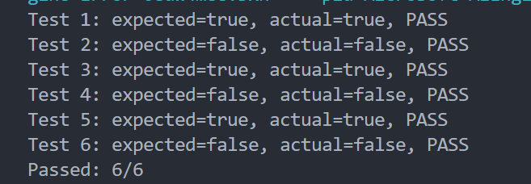

#### 4.3. 使⽤固定 CNF {{1, 2}, {-1, 3}, {-2, -3}} 和赋值 x1=true, x2=false, x3=true 检查函数，确认其返回 true。随后只把 x3 改为 false，再次运⾏函数，并指出哪个⼦句因此变为不满⾜。
用`test_fixed.cpp`来检查函数
```c++
#include <iostream>
#include <vector>
#include "lab2_solution.cpp"

int main() {
    std::vector<std::vector<int>> clauses = {
        {1, 2}, {-1, 3}, {-2, -3}
    };

    std::cout << std::boolalpha;
    bool allMatch = true;

    // 分别检查 x3=true 和 x3=false，x1、x2 保持不变。
    for (int x3 : {1, 0}) {
        std::vector<int> assignment = {1, 0, x3};

        // 待验证函数的计算结果。
        bool actual = satisfiesCnf(3, clauses, assignment);

        // 独立按原始逻辑公式计算，不调用 satisfiesCnf。
        bool x1Value = assignment[0] == 1;
        bool x2Value = assignment[1] == 1;
        bool x3Value = assignment[2] == 1;

        bool c1 = x1Value || x2Value;
        bool c2 = !x1Value || x3Value;
        bool c3 = !x2Value || !x3Value;
        bool direct = c1 && c2 && c3;

        bool match = actual == direct;
        allMatch = allMatch && match;

        std::cout << "Assignment: "
                  << x1Value << ", "
                  << x2Value << ", "
                  << x3Value << '\n';

        std::cout << "Clause 1: " << c1 << '\n';
        std::cout << "Clause 2: " << c2 << '\n';
        std::cout << "Clause 3: " << c3 << '\n';

        std::cout << "Direct evaluation: " << direct << '\n';
        std::cout << "satisfiesCnf: " << actual << '\n';
        std::cout << "Match: " << match << "\n\n";
    }

    return allMatch ? 0 : 1;
}
```
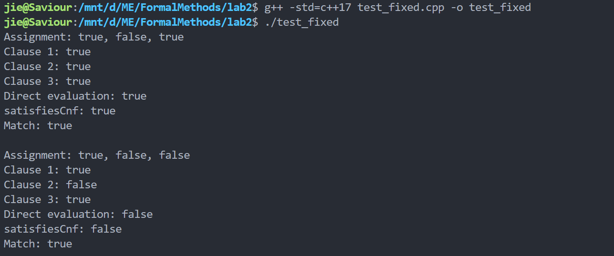
根据输出结果，我们可以看到：
| CNF | 检查项 | 翻转前 `{1,0,1}` | 翻转后 `{1,0,0}` |
|:-:|:-:|:-:|:-:|
| {1,2} | \(x_1\lor x_2\) | true | true |
| {-1,3} | \(\neg x_1\lor x_3\) | true | **false** |
| {-2,-3} | \(\neg x_2\lor\neg x_3\) | true | true |
| \ |原始公式直接计算 | true | false |
| \ |`satisfiesCnf` 返回值 | true | false |
| \ |两种计算结果是否一致 | 是 | 是 |

*可以看到，在\(x_3\)由`true`变为`false`后，{-1, 3}（`-1 3 0`）因此变得不再满足*

**对CNF中“所有⼦句均满⾜”含义撰写的结论：**
> 对CNF来说，“所有子句均满足”是判定整个命题公式为真的**充要**条件，因为CNF是各子句的合取（\(\land\)），所以只有所有的子句均为真才可以得到整个命题为真的结论。而对于子句，因为其是文字的析取（\(\lor\)），只要子句内部其中一个文字为真，这个子句就是真。

### 任务 5：使⽤阻塞⼦句寻找多个解
**任务摘要：** 每找到⼀个解，就增加⼀条排除该解的阻塞⼦句，继续求解，从⽽枚举同⼀组业务规则下的多个不同⽅案。
> 阻塞⼦句（blocking clause）⽤于排除求解器刚刚找到的完整赋值。例如当前模型为`x1=true, x2=false,x3=true`，可加⼊`(-x1 OR x2 OR -x3)`；这条⼦句只排除该模型，不直接指定下⼀个答案。

本任务使⽤⼀个固定的测试策略选择问题，不依赖任务 3 的⾃选模型。
定义变量如下：
| 变量 | 编号 | 为真时的含义 |
|:-:|:-:|:-:|
| U | 1 | 执⾏单元测试 |
| I | 2 | 执⾏集成测试 |
| S | 3 | 执⾏静态分析 |
| C | 4 | 收集覆盖率 |

**规则如下：** 
单元测试和集成测试⾄少执⾏⼀种；
静态分析要求执⾏单元测试；
覆盖率收集要求执⾏集成测试；
静态分析和覆盖率收集不能同时启⽤。
保存为`test_strategy.cnf`：
```cnf
c U=1, I=2, S=3, C=4
p cnf 4 4
1 2 0
-3 1 0
-4 2 0
-3 -4 0
```
#### 5.1. 运⾏原始 CNF，把第⼀个模型还原为测试策略并逐条检查四条规则。
##### 5.1.1 运行`test_strategy.cnf`：
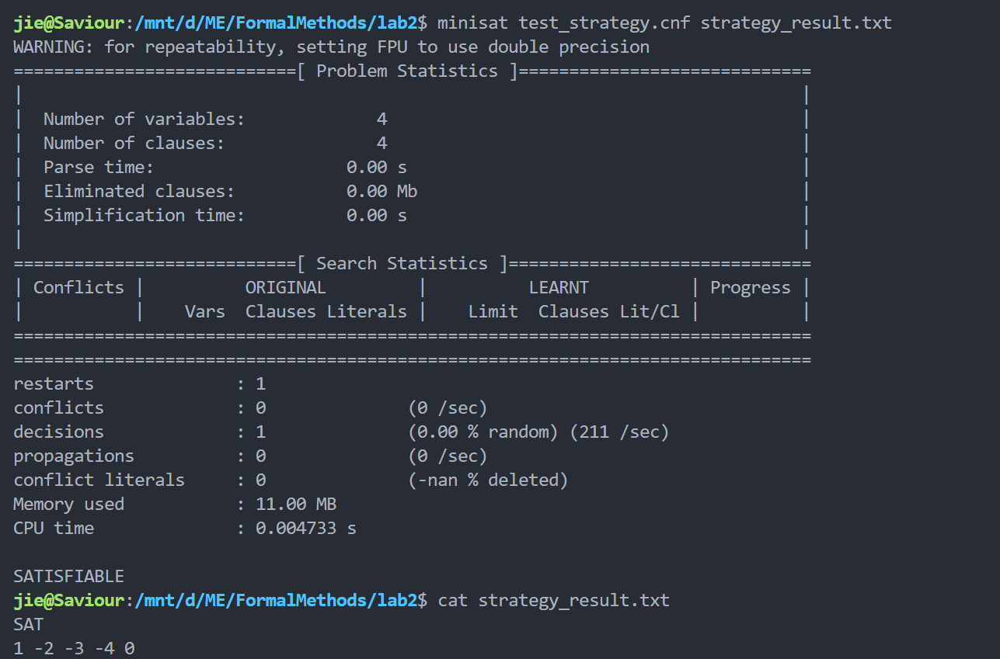
##### 5.1.2 把第⼀个模型还原为测试策略并逐条检查四条规则:
首个模型为`1 -2 -3 -4 0`，表示只执行单元测试，即\(U=T,I=F,S=F,C=F\)
| 规则 | DIMACS子句 | 逻辑公式 | 测试策略 | 代入结果 |
|:-:|:-:|:-:|:-:|:-:|
| 1 | `1 2 0` | \(U\lor I\) | 单元测试和集成测试至少要进行一种 | T |
| 2 | `-3 1 0` | \(\neg S\lor U\) | 静态分析要求执行单元测试 | T |
| 3 | `-4 2 0` | \(\neg C\lor I\) | 收集覆盖率要求执行集成测试 | T |
| 4 | `-3 -4 0` | \(\neg S\lor \neg C\) | 静态分析和收集覆盖率不能同时执行| T |

*注释：*\(\neg S\lor U\)即\(S\rightarrow U\)，\(\neg C\lor I\)即\(C\rightarrow I\)，\(\neg S\lor \neg C\)即\(\neg(S\land C)\)
#### 5.2. 根据每次得到的完整模型构造阻塞⼦句，重复运⾏ MiniSAT，直到结果变为 UNSAT。列出全部不同测试策略和每次加⼊的阻塞⼦句。
##### 5.2.1 根据每次得到的完整模型构造阻塞⼦句，重复运⾏ MiniSAT，直到结果变为 UNSAT：

> **PS：将阻塞子句加入最后一行的时候要同步更新`p cnf 4 4`,每加一次都应使最右侧的数字加一。**
**我在这里忘记加了所以有警告`WARNING!DIMACS header mismatch: wrong number of clauses.`，不过`MiniSAT`仍读取了新增子句（截图中的`number of clauses`是+1了的），所以枚举结果也没有因此失效，我也就没有重做了。**

**第一次运行的结果：**
构造阻塞子句：`-1 2 3 4 0`，加入`test_strategy.cnf`最后一行。
**第二次运行的结果：**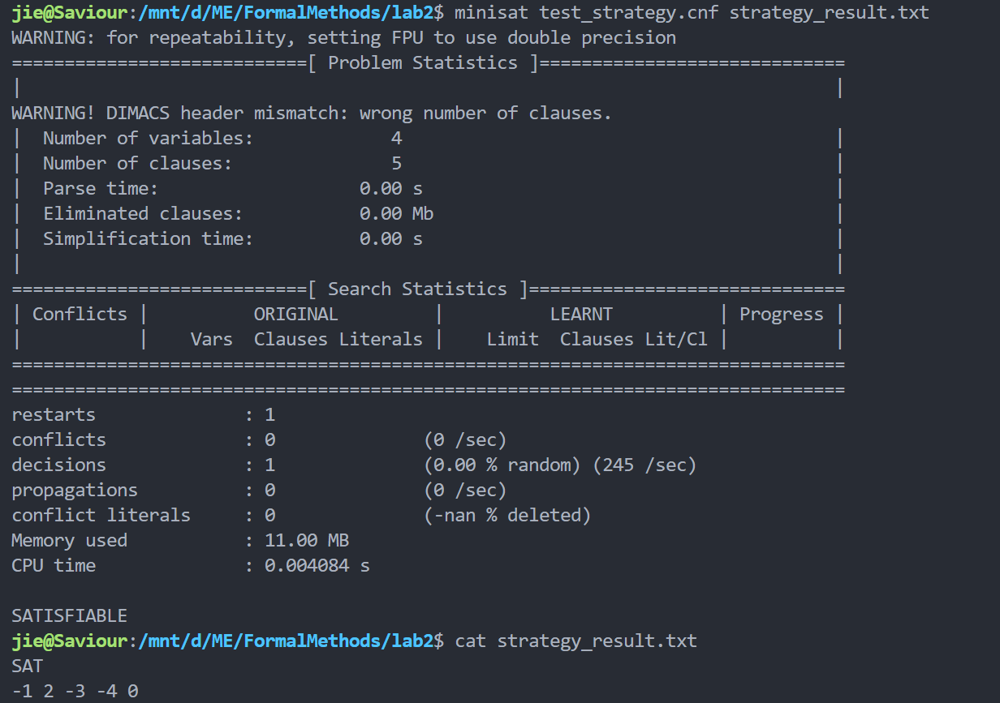
构造阻塞子句：`1 -2 3 4 0`，加入`test_strategy.cnf`最后一行。
**第三次运行的结果：**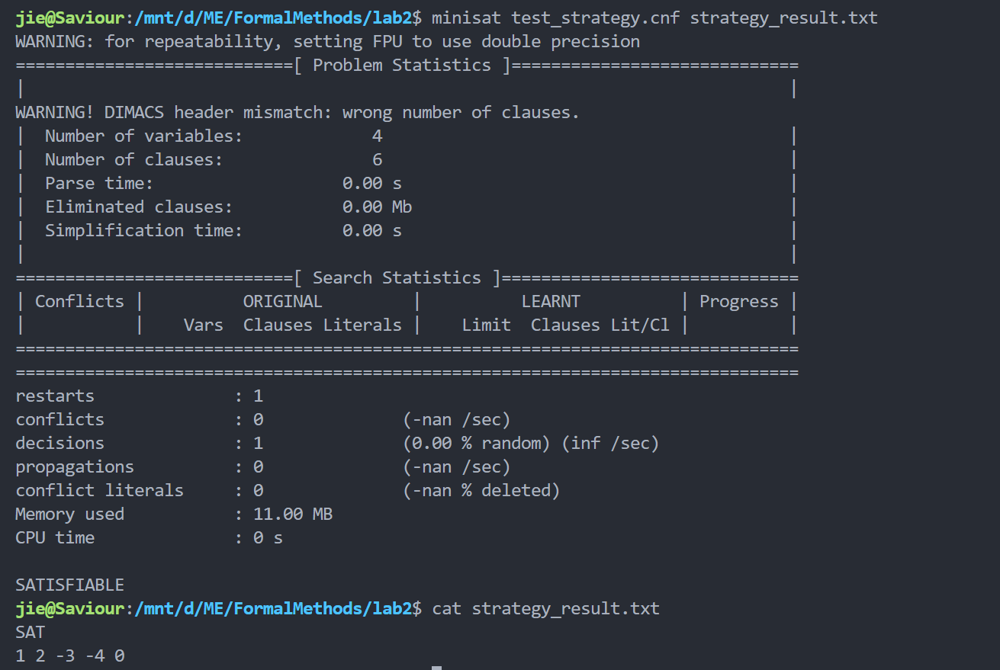
构造阻塞子句：`-1 -2 3 4 0`，加入`test_strategy.cnf`最后一行。
**第四次运行的结果：**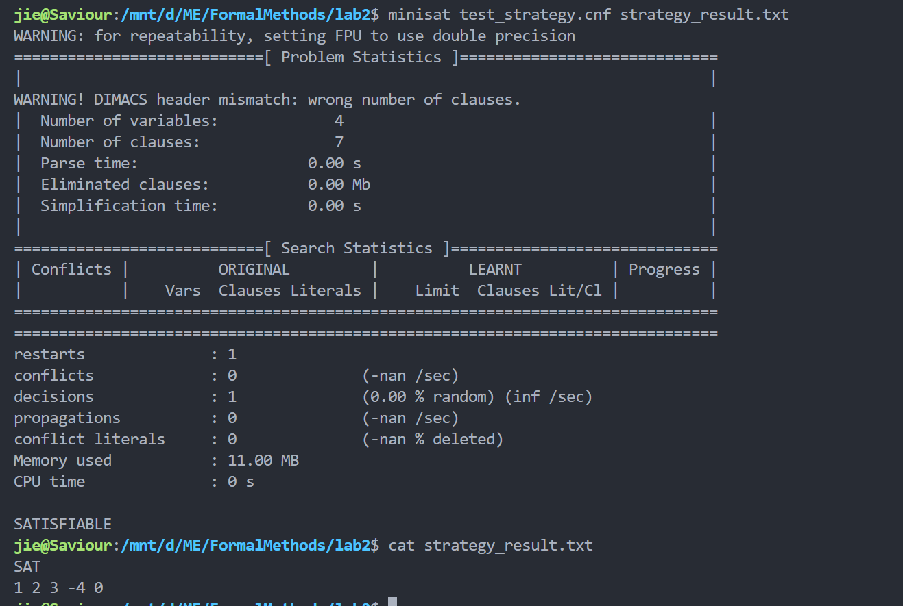
构造阻塞子句：`-1 -2 -3 4 0`，加入`test_strategy.cnf`最后一行。
**第五次运行的结果：**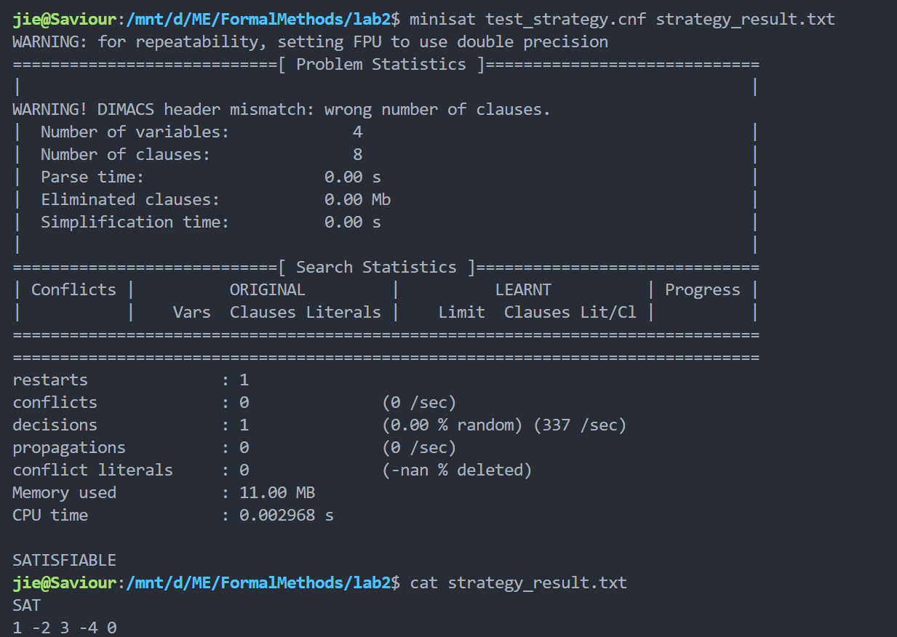
构造阻塞子句：`-1 2 -3 4 0`，加入`test_strategy.cnf`最后一行。
**第六次运行的结果：**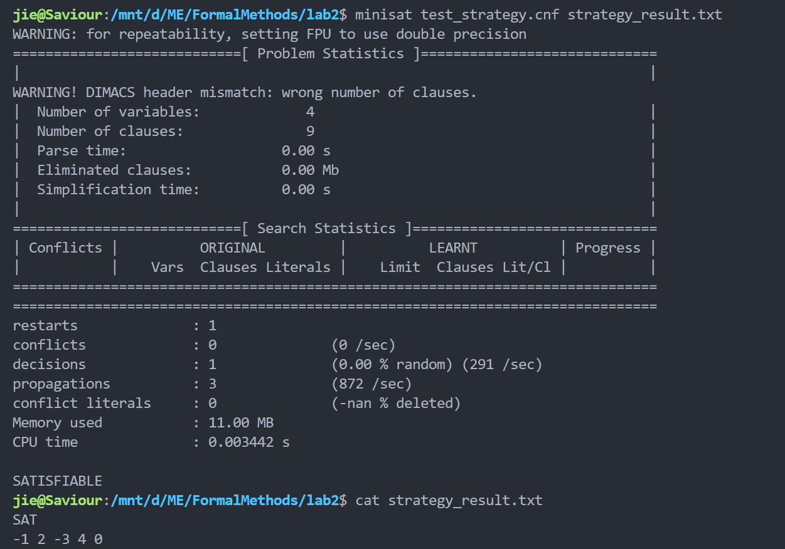
构造阻塞子句：`1 -2 3 -4 0`，加入`test_strategy.cnf`最后一行。
**第七次运行的结果：**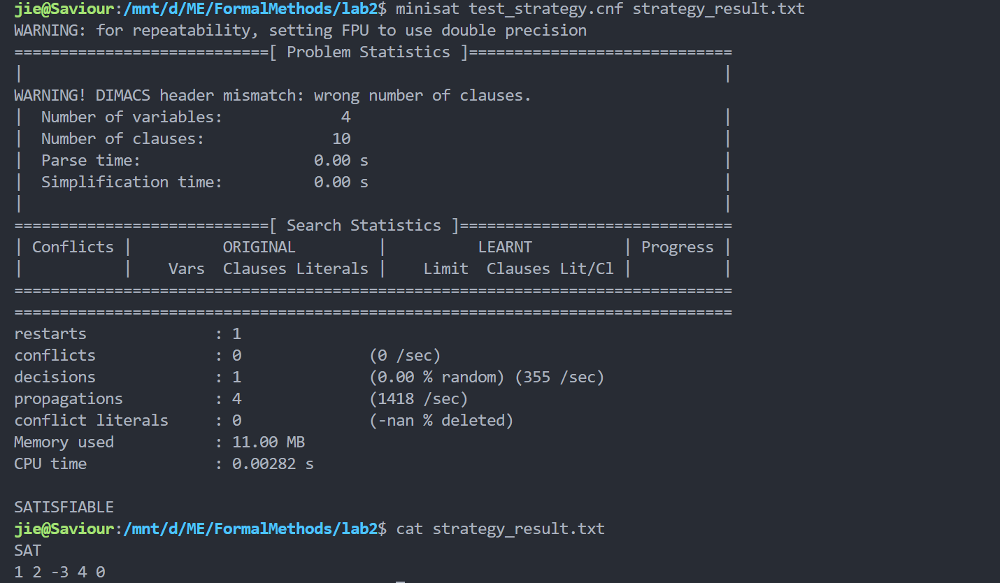
构造阻塞子句：`-1 -2 3 -4 0`，加入`test_strategy.cnf`最后一行。
**第八次运行的结果**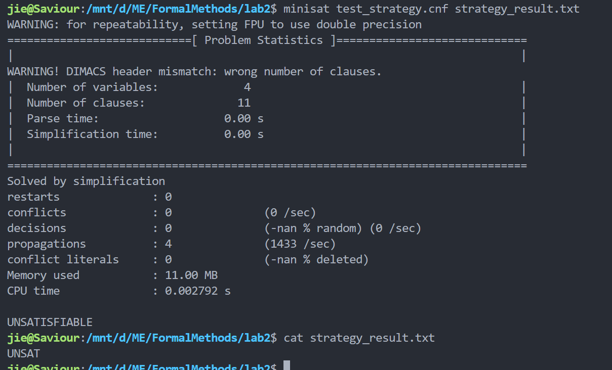
这次的结果终于变成了`UNSAT`。

##### 5.2.2 列出全部不同测试策略和每次加⼊的阻塞⼦句：
| 运行编号 | 运行结果| 对应的测试策略 | 最后加入的阻塞子句 |
|:-:|:-:|:-:|:-:|
| 1 | `SAT`, `1 -2 -3 -4 0`| 只执行单元测试 | `-1 2 3 4 0` |
| 2 | `SAT`,`-1 2 -3 -4 0` | 只执行集成测试 | `1 -2 3 4 0` |
| 3 | `SAT`,`1 2 -3 -4 0` | 同时执行单元测试与集成测试 | `-1 -2 3 4 0` |
| 4 | `SAT`,`1 2 3 -4 0` | 同时执行单元测试、集成测试与静态分析 | `-1 -2 -3 4 0` |
| 5 | `SAT`,`1 -2 3 -4 0` | 同时执行单元测试与静态分析 | `-1 2 -3 4 0` |
| 6 | `SAT`,`-1 2 -3 4 0` | 执行集成测试的同时收集覆盖率 | `1 -2 3 -4 0` |
| 7 | `SAT`, `1 2 -3 4 0`| 同时执行单元测试与集成测试并收集覆盖率 | `-1 -2 3 -4 0` |
| 8 | `UNSAT` | 无 | 无 |

#### 5.3. 每得到⼀个模型，都使⽤任务 4 的 satisfiesCnf 检查原始四条⼦句，并确认新模型在四个业务变量上与此前模型不同。根据最终的 UNSAT 说明为什么已经没有遗漏其它完整赋值。
##### 5.3.1每得到⼀个模型，都使⽤任务 4 的 satisfiesCnf 检查原始四条⼦句，并确认新模型在四个业务变量上与此前模型不同：
原始4条子句是`1 2 0`,`-3 1 0`,`-4 2 0`,`-3 -4 0`，所以`clauses={{1, 2}, {-3, 1},{-4, 2},{-3, -4}}`，
然后依次调用satisfiesCnf()，检查5.2中的7个模型（`{1, 0, 0, 0},{0, 1, 0, 0},{1, 1, 0, 0},{1, 1, 1, 0},{1, 0, 1, 0},{0, 1, 0, 1},{1, 1, 0, 1}`）并彼此进行比较，确认四个业务变量与此前不同。
`代码如下：`
```c++
#include <iostream>
#include <vector>
#include "lab2_solution.cpp"

int main() {
    // 只检查原始四条业务规则，不加入阻塞子句
    const std::vector<std::vector<int>> clauses = {
        {1, 2},
        {-3, 1},
        {-4, 2},
        {-3, -4}
    };
    // 每行依次表示U、I、S、C，1为真，0为假
    const std::vector<std::vector<int>> models = {
        {1, 0, 0, 0},
        {0, 1, 0, 0},
        {1, 1, 0, 0},
        {1, 1, 1, 0},
        {1, 0, 1, 0},
        {0, 1, 0, 1},
        {1, 1, 0, 1}
    };

    bool allPassed = true;
    //让bool类型以true/false的形式输出，而不是1/0
    std::cout << std::boolalpha;
    for (int i = 0; i < static_cast<int>(models.size()); i++){
        // 检查当前模型是否满足原始CNF
        bool satisfies = satisfiesCnf(4, clauses, models[i]);
        // 将当前模型与此前的每一个模型比较
        bool isNew = true;
        for (int j = 0; j < i; j++){
            if (models[i] == models[j]) {
                isNew = false;
                break;
            }
        }
        //
        std::cout << "Model " << i + 1 << ": ";
        for (int value : models[i]) {
            std::cout << value << ' ';
        }
        std::cout << "| satisfies=" << satisfies
                  << " | new=" << isNew << '\n';
        //只要有一项不通过，整体就记为失败
        if (!satisfies || !isNew) {
            allPassed = false;
        }
    }
    std::cout << "All checks passed: " << allPassed << '\n';
    return allPassed ? 0 : 1;
}
```
运行结果如下：
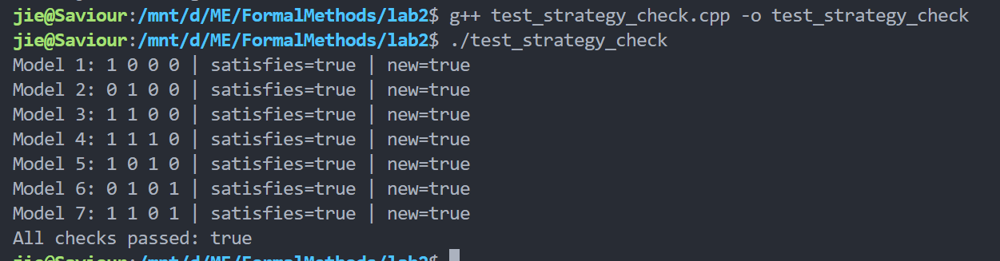
##### 5.3.2 根据最终的 UNSAT 说明为什么已经没有遗漏其它完整赋值：
> 首先，在前面5.3.1的验证中，运行结果显示，七个模型均满足原始CNF并且是互不相同的，这说明了5.2得到的7个模型也都是正确的。
> 在第七次将之前的结果全部剔除之后（通过阻塞子句：只排除刚刚找到的完整赋值，不会排除其他完整赋值），第八次得到`UNSAT`。

第八次得到`UNSAT`说明不再存在这样的赋值了：因为如果还有其他赋值的话，它应当与之前找到的七个模型都不同，仍能满足全部阻塞子句，结果应该返回`SAT`，而第八次的结果是`UNSAT`，所以不存在其它满足规则的完整赋值了，故而没有遗漏。

#### 5.4. 增加业务规则“必须执⾏静态分析”，即加⼊单元⼦句 3 0，重新完整枚举。⽐较修改前后的⽅案数量，并解释哪些⽅案被新规则排除。
##### 5.4.1 重新枚举：
新增`test_strategy2.cnf`：
```cnf
c U=1, I=2, S=3, C=4
p cnf 4 5 
1 2 0
-3 1 0
-4 2 0
-3 -4 0
3 0
```
**第一次运行的结果：**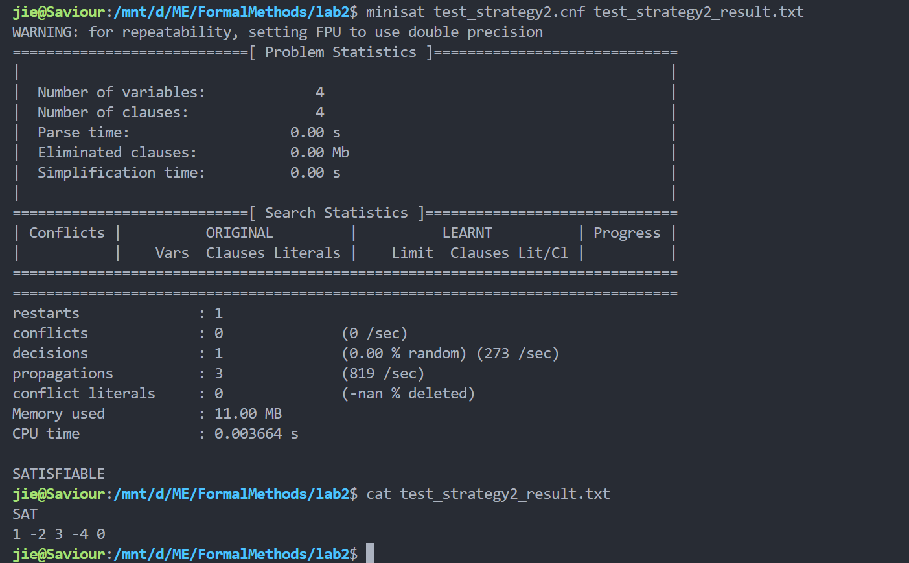
构造阻塞子句：`-1 2 -3 4 0`，加入`test_strategy2.cnf`最后一行；
同时把`p cnf 4 5`改为`p cnf 4 6`。
**第二次运行的结果：**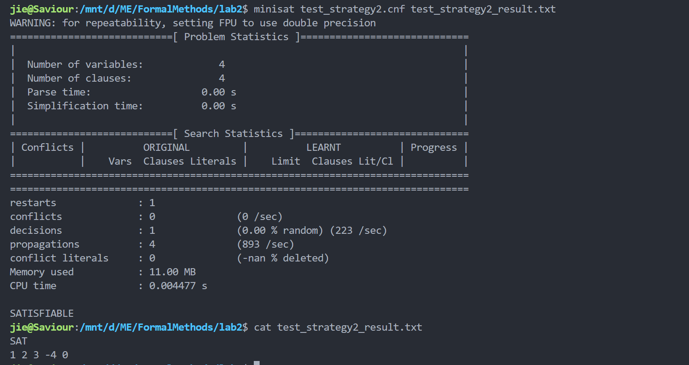
构造阻塞子句：`-1 -2 -3 4 0`，加入`test_strategy2.cnf`最后一行；
同时把`p cnf 4 6`改为`p cnf 4 7`。
**第三次运行的结果**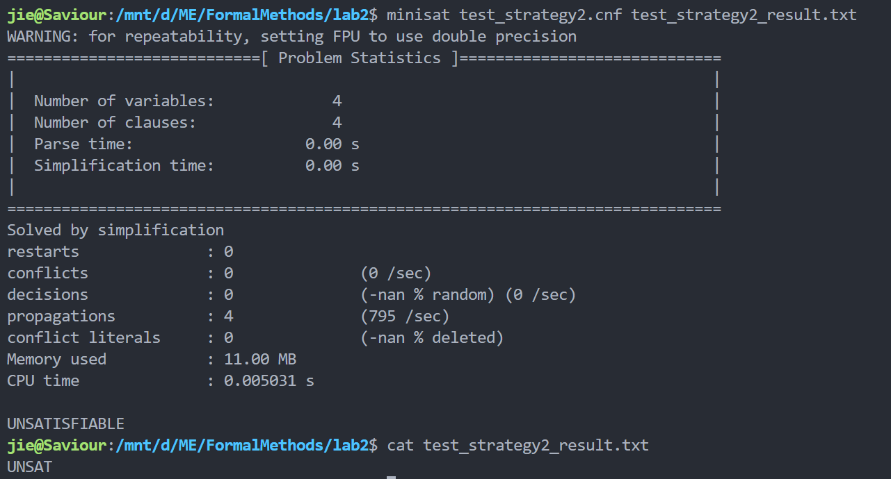
这次的结果变成了`UNSAT`。
##### 5.4.2 ⽐较修改前后的⽅案数量，并解释哪些⽅案被新规则排除：
> PS:我注意到这里的`number of clauses`一直为4，没有像5.2那样随着阻塞子句的增加而增加。在询问了*LLM*之后得知，这是因为`miniSAT`在读到`3 0`时触发了单元传播，直接固定了三个变量：`S=true，U=true，C=false`，接下来只要记住I即可，因此，后面读入的阻塞子句立即被化简为单元赋值或冲突，不必作为普通子句保存。
> 而之前加了是因为没有提前确定的变量值，不能直接化简为某个变量必须为真，所以`MiniSAT`就把整条子句保存下来，内部计数加1。

*对比如下：（未被删除线划掉的方案为加入`3 0`后允许的方案）*
| 运行编号 | 运行结果| 对应的测试策略 | 最后加入的阻塞子句 |
|:-:|:-:|:-:|:-:|
| ~~1~~ | ~~`SAT`, `1 -2 -3 -4 0`~~| ~~只执行单元测试~~ | ~~`-1 2 3 4 0`~~ |
| ~~2~~ | ~~`SAT`,`-1 2 -3 -4 0`~~ | ~~只执行集成测试~~ | ~~`1 -2 3 4 0`~~ |
| ~~3~~ | ~~`SAT`,`1 2 -3 -4 0`~~ | ~~同时执行单元测试与集成测试~~ | ~~`-1 -2 3 4 0`~~ |
| 4 | `SAT`,`1 2 3 -4 0` | 同时执行单元测试、集成测试与静态分析 | `-1 -2 -3 4 0` |
| 5 | `SAT`,`1 -2 3 -4 0` | 同时执行单元测试与静态分析 | `-1 2 -3 4 0` |
| ~~6~~ | ~~`SAT`,`-1 2 -3 4 0`~~ | ~~执行集成测试的同时收集覆盖率~~ | ~~`1 -2 3 -4 0`~~ |
| ~~7~~ | ~~`SAT`, `1 2 -3 4 0`~~| ~~同时执行单元测试与集成测试并收集覆盖率~~ | ~~`-1 -2 3 -4 0`~~ |
| 8 | `UNSAT` | 无 | 无 |

对比修改前的⽅案，之前五个未执行静态分析的方案均被排除（1，2，3，6，7）。

保留的两个方案均执行单元测试和静态分析，不收集覆盖率，区别仅在于是否执行集成测试。

**对阻塞⼦句为什么能够逐个排除已有完整赋值⾃⾏撰写的结论：**
阻塞子句要求下一次的赋值至少有一个变量与当前模型不同。构造时只排除当前模型，不排除其他答案：
- 将当前完整模型中的每个文字反号，再用或连接。当前模型会使这些文字全部为假，因此无法满足这条子句；
- 但是其他完整赋值因为至少有一个变量不同，所以能使其中一个文字为真。所以，一条阻塞子句恰好排除一个完整赋值。
  
所以，每次找到新模型后继续添加对应的阻塞子句，并保留之前的阻塞子句，就能逐个排除已有模型，避免重复找到相同方案。

### 任务 6：检查两份 CNF 是否等价
**任务摘要：** 系统检查两份写法不同的候选 CNF 是否具有相同模型集合，解释它们为何等价，再通过删除⼀个⼦句制造差异并寻找区分赋值。

某服务包含以下六个业务变量：
| 变量 | 编号 | 为真时的含义 |
|:-:|:-:|:-:|
| A | 1 | 启⽤ API 服务 |
| W | 2 | 启⽤ Web 界⾯ |
| D | 3 | 启⽤数据库 |
| C | 4 | 启⽤缓存 |
| L | 5 | 启⽤⽇志 |
| M | 6 | 启⽤监控 |

需求如下：
1. API 服务和 Web 界⾯⾄少启⽤⼀个。
2. API 服务启⽤当且仅当数据库启⽤。
3. Web 界⾯启⽤时必须启⽤缓存。
4. 缓存启⽤时必须启⽤数据库。
5. 数据库启⽤时必须启⽤⽇志。
6. 监控启⽤当且仅当⽇志启⽤。

下⾯是两份候选编码。它们的⼦句数量和具体形式不同，不要仅根据⽂件外观判断⼆者是否等价。保存第⼀份
为`encoding_a.cnf：
```cnf
c A=1, W=2, D=3, C=4, L=5, M=6
p cnf 6 8
1 2 0
-1 3 0
-3 1 0
-2 4 0
-4 3 0
-3 5 0
-6 5 0
-5 6 0
```
保存第⼆份为`encoding_b.cnf`：
```cnf
c A=1, W=2, D=3, C=4, L=5, M=6
p cnf 6 12
-4 3 0
-3 5 0
-6 5 0
-5 6 0
1 2 4 0
1 2 -4 0
-1 3 6 0
-1 3 -6 0
-3 1 2 0
-3 1 -2 0
-2 4 5 0
-2 4 -5 0
```
两个 CNF 在业务变量上等价，是指对`A、W、D、C、L、M`的每⼀种完整赋值，两份 CNF 的满⾜结果都相同。能够满⾜其中⼀份⽽不满⾜另⼀份的赋值称为**区分赋值**（distinguishing assignment）。如果不存在区分赋值，两个 CNF 的模型集合相同。
#### 6.1. 把六条需求写成命题逻辑公式，并分别运⾏两份编码，记录求解状态和⼀个模型。(两份编码都是 SAT 只能说明它们各⾃⾄少有⼀个模型，不能据此判断模型集合是否相同；等价性由下⼀步的完整赋值检查确定。)

| 编号 | 需求 | 命题逻辑公式 |
|:-:|:-:|:-:|
| 1 | API 服务和 Web 界⾯⾄少启⽤⼀个 | \(A\lor W\) |
| 2 | API 服务启⽤当且仅当数据库启⽤ | \(A\leftrightarrow  D\) |
| 3 | Web 界⾯启⽤时必须启⽤缓存 | \(W\rightarrow C\) |
| 4 | 缓存启⽤时必须启⽤数据库 | \(C\rightarrow D\) |
| 5 | 数据库启⽤时必须启⽤⽇志 | \(D\rightarrow L\) |
| 6 | 监控启⽤当且仅当⽇志启⽤ | \(M\leftrightarrow  L\) |

运行`encoding_a.cnf`：
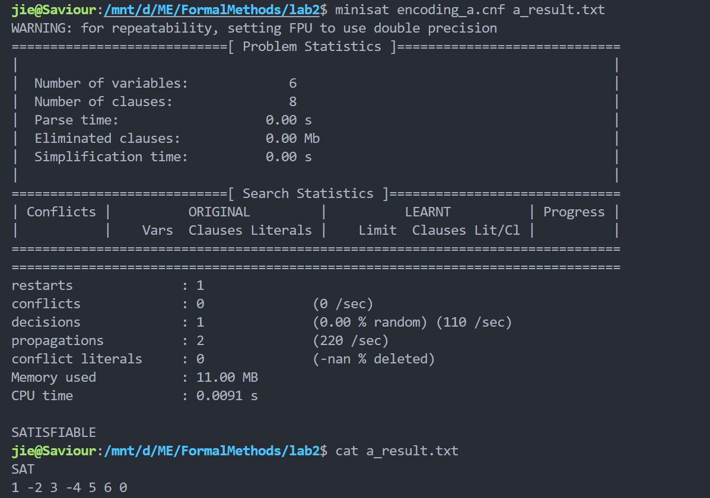

运行`encoding_b.cnf`：
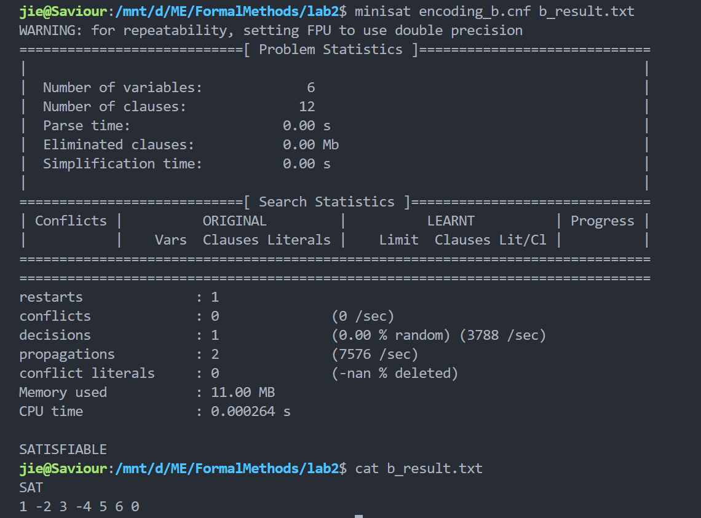

可以看到，求解状态均为`SAT`,模型是`1 -2 3 -4 5 6 0`。
即：**启用API服务，数据库，日志和监控**。
#### 6.2. 设计⼀个检查函数，枚举六个变量的全部 2^6=64 种赋值，并调⽤任务 4 的 satisfiesCnf ⽐较 A 和 B在每种赋值下的结果，从⽽判断两个编码是否等价。函数的接⼝和结果记录⽅式由你决定。使⽤该函数检查两份原始编码，并在实验报告中提交函数代码、检查⽅法和结果。
新增一个`test_equivalence.cpp`，内容如下：
```c++
#include<iostream>
#include<vector>
#include "lab2_solution.cpp"

bool check_equivalence(int variableCount,
    const std::vector<std::vector<int>>& clausesA,
    const std::vector<std::vector<int>>& clausesB){
    int modelCountA = 0;
    int modelCountB = 0;
    //记录有多少个区分赋值
    int differenceCount = 0;

    std::cout << std::boolalpha;

    //计算循环总数，2^variableCount次
    int total = 1 << variableCount;
    //i可以表示0~2^variableCount-1，
    //转换成二进制的话可覆盖total种取值
    for(int i = 0;i < total;i++){
        std::vector<int> assignment(variableCount);
        for(int j = 0;j < variableCount;j++){
            //将读取的那一位移到最右边，只保留最后一位
            assignment[j] = (i >> j) & 1;
        }
        bool resultA = satisfiesCnf(variableCount, clausesA, assignment);
        bool resultB = satisfiesCnf(variableCount, clausesB, assignment);
        
        if(resultA)
            modelCountA++;
        if(resultB)
            modelCountB++;
        if(resultA != resultB){
            differenceCount++;
            std::cout << "Distinguishing assignment (A W D C L M): "; 
            for(int value : assignment)
                std::cout << value << ' ';
            std::cout << "| encoding A=" << resultA
                      << " | encoding B=" << resultB << '\n';
        }
    }

    bool equivalent = differenceCount == 0;
    std::cout << "Assignments checked: " << total << '\n';
    std::cout << "Models of encoding A: " << modelCountA << '\n';
    std::cout << "Models of encoding B: " << modelCountB << '\n';
    std::cout << "Distinguishing assignments: " << differenceCount << '\n';
    std::cout << "Equivalent: " << equivalent << '\n';

    return equivalent;
}

int main(){
    const std::vector<std::vector<int>> clausesA = {
        {1, 2},
        {-1, 3},
        {-3, 1},
        {-2, 4},
        {-4, 3},
        {-3, 5},
        {-6, 5},
        {-5, 6}
    };
    const std::vector<std::vector<int>> clausesB = {
        {-4, 3},
        {-3, 5},
        {-6, 5},
        {-5, 6},
        {1, 2, 4},
        {1, 2, -4},
        {-1, 3, 6},
        {-1, 3, -6},
        {-3, 1, 2},
        {-3, 1, -2},
        {-2, 4, 5},
        {-2, 4, -5}
    };

    check_equivalence(6, clausesA, clausesB);

    return 0;
}
```
**函数检查方法：**
- 首先通过变量数计算出总共要枚举多少次赋值
- 然后循环，把0 ~ \(2^{variable}\) - 1分别看成六位二进制数存入`assignment`数组，每一位的0或1对应一个变量的假或真。
- 对每个`assignment`分别调用`satisfiesCnf()`，检查编码A和B，若结果不同则记为区分赋值并打印
- 遍历结束后，区分赋值数为0即判定两份编码等价，否则不等价。

**函数检查结果：**
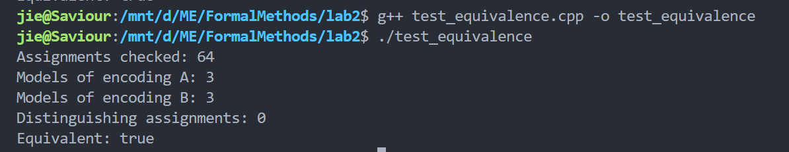

#### 6.3. 使⽤命题逻辑等价变换，逐步推导为什么下⾯的公式成⽴，并说明这项变换为什么改变了 CNF 的写法和⼦句数量，却没有改变模型集合：
```
        K 等价于 (K OR x) AND (K OR NOT x)
```
*其中 K 可以是⼀个包含多个⽂字的⼦句，x 是另⼀个布尔变量。推导中应写明所使⽤的分配律、⽭盾律和同⼀律。*

**证：**(K OR x) AND (K OR NOT x)
$\equiv$ \((K\lor x)\land(K\lor \neg x)\) **(转换成逻辑公式)**
$\equiv$ \(K\lor(x\land \neg x)\) **(分配律)**
$\equiv$ \(K\lor false\) **(矛盾律)**
$\equiv$ \(K\) **(同一律)**

整个公式的真假取决于K的真假，不论\(x\)如何取值，右边的真假始终与\(K\)相同：
- 若K为真，原式可写作： \((true\lor x)\land(true\lor \neg x)\) $\equiv$ \(true\land true\) $\equiv$ \(true\)
- 若K为假，原式可写作： \((false\lor x)\land(false\lor \neg x)\) $\equiv$ \(x\land \neg x\) $\equiv$ \(false\)
  
所以，虽然写法和子句数量发生变化，但对每一种完整赋值，替换前后的真假始终一致，所以模型集合不变。

#### 6.4. 删除 B 中的⼦句 1 2 4 0 并把⼦句数改为 11。使⽤任意可靠⽅法找出⼀条使原始编码 A 与修改后的编码 B 得到不同结果的赋值。列出 A、W、D、C、L、M 的真假，将其翻译为完整的服务配置；再把该赋值分别代⼊两个编码，指出结果不同的具体⼦句和对应的业务需求。

##### 6.4.1 使⽤任意可靠⽅法找出⼀条使原始编码 A 与修改后的编码 B 得到不同结果的赋值：
- 先新增一个文件`encoding_b2.cnf`:删除B中的⼦句`1 2 4 0`并把⼦句数改为11。
- 然后，可以使用我在6.2里设计的检查函数，把`test_equivalence.cpp`中clausesB的`{1, 2, 4},`这一行删去：
  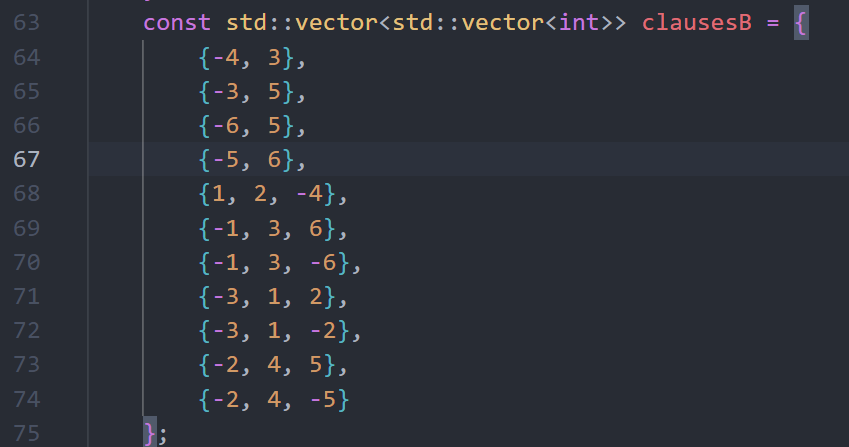
- 运行`test_equivalence.cpp`，查看结果：
  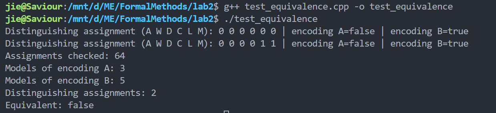

> 这里和6.2一开始出现了错误结果：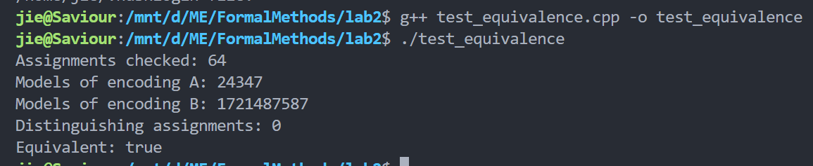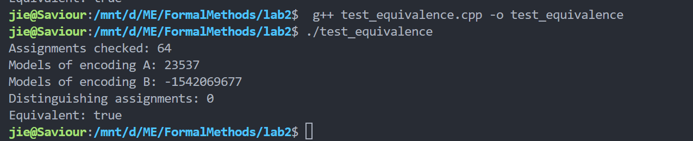
> 经检查后发现，这是因为我在一开始忘了给 `modelCountA` 与 `modelCountB` 初始化。
> 现二者均已修订：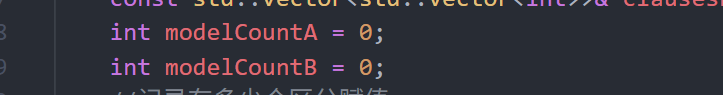

*最后将 `{1, 2, 4},`补充回cpp文件中。*、

##### 6.4.2 列出 A、W、D、C、L、M 的真假，将其翻译为完整的服务配置：
```powershell
Distinguishing assignment (A W D C L M): 0 0 0 0 0 0 | encoding A=false | encoding B=true
Distinguishing assignment (A W D C L M): 0 0 0 0 1 1 | encoding A=false | encoding B=true
```
| 变量 | 功能 | 区分赋值 1 | 区分赋值 2 |
|---|---|---|---|
| A | API 服务 | false，关闭 | false，关闭 |
| W | Web 界面 | false，关闭 | false，关闭 |
| D | 数据库 | false，关闭 | false，关闭 |
| C | 缓存 | false，关闭 | false，关闭 |
| L | 日志 | false，关闭 | true，启用 |
| M | 监控 | false，关闭 | true，启用 |

即：
- *(区分赋值1)*：API服务，Web界面，数据库，缓存，日志，监控均不启用。
- *(区分赋值2)*：只启用日志与监控。

##### 6.4.3 把赋值分别代⼊两个编码，指出结果不同的具体⼦句和对应的业务需求：
*以区分赋值1为例：* **(A W D C L M): F F F F F F**
- A:
  
| 子句 | 代入结果 |
|---|---|
| `1 2 0` |  **\(F\lor F=F\)** |
| `-1 3 0` |  \(T\lor F=T\) |
| `-3 1 0` |  \(T\lor F=T\) |
| `-2 4 0` |  \(T\lor F=T\) |
| `-4 3 0` |  \(T\lor F=T\) |
| `-3 5 0` |  \(T\lor F=T\) |
| `-6 5 0` |  \(T\lor F=T\) |
| `-5 6 0` |  \(T\lor F=T\) |

因为A不满足第一条`1 2 0`，所以最终结果为`false`。`1 2 0`对应的是业务需求1：`API 服务和 Web 界面至少启用一个`。

- B:

| 子句 | 代入结果 |
|---|---|
| `-4 3 0` | \(T\lor F=T\) |
| `-3 5 0` | \(T\lor F=T\) |
| `-6 5 0` | \(T\lor F=T\) |
| `-5 6 0` | \(T\lor F=T\) |
| `1 2 -4 0` | \(F\lor F\lor T=T\) |
| `-1 3 6 0` | \(T\lor F\lor F=T\) |
| `-1 3 -6 0` | \(T\lor F\lor T=T\) |
| `-3 1 2 0` | \(T\lor F\lor F=T\) |
| `-3 1 -2 0` | \(T\lor F\lor T=T\) |
| `-2 4 5 0` | \(T\lor F\lor F=T\) |
| `-2 4 -5 0` | \(T\lor F\lor T=T\) |

B全部满足，均为`true`。

**对`语法形式不同为什么仍可能表达相同模型集合`撰写的结论：**
> 因为判断两份编码是否等价，关键是看它们分别允许哪些赋值，而不是语法的形式。就如6.3一样，一条子句被替换成两条与之等价的子句，但对于不同的赋值二者最后的真假都相同。

## *LLM使用说明*：
1. 通过LLM了解到：
> PowerShell 找不到 minisat 程序，可能是尚未安装，或没有加入 PATH。
Windows 下建议通过 WSL + Ubuntu 安装和运行。

2. 通过LLM了解DIMACS CNF相关的规则和变量说明。
3. 通过LLM获悉md文件逻辑符号如何表示：*（LaTeX）*
> `\(` 和 `\)`：标记一段行内公式的开始和结束，正常渲染后不会显示。
> 普通的 `(` 和 `)`：公式内容中的括号，会显示出来。

4. 使⽤LLM为⾃选的软件⼯程场景⽣成SAT模型，整理⾃然语⾔需求与CNF⼦句的对应关系，再使⽤MiniSAT求解。*(任务3)*
5. 使用LLM辅助完成*任务4*，*任务5*与*任务6*的代码理解与编程。
6. 利用LLM解释`number of clauses`的在*任务5*不同场景变化不同的原因。
